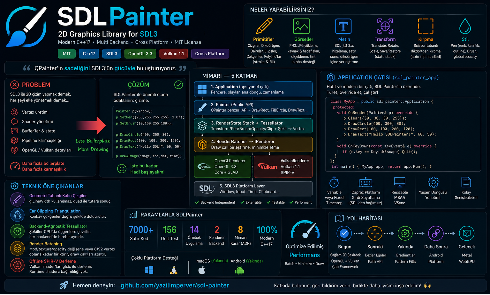

[Türkçe](README.tr.md) | **English**

<div align="center">
  
  <h1>SDLPainter</h1>
  <p><strong>A C++17 2D drawing library for SDL3 with dual OpenGL/Vulkan backends.</strong></p>
  <p>
    
    
    
    
    
  </p>
</div>



> **Note:** The infographics above and below, and the design documents under
> `doc/`, are currently written in Turkish. The API itself and all source
> comments follow the naming conventions shown in this document.

> SDLPainter is an independent community project. It is not affiliated with, nor
> endorsed by, the SDL team.

## Why SDLPainter?

SDLPainter makes 2D drawing with SDL3 straightforward. You no longer have to
deal with vertex generation, shader compilation, buffer and state management,
pipeline setup, or the differences between OpenGL and Vulkan.

SDLPainter lets you focus **only on drawing**:

- **One API, multiple backends** — The same code produces the same result on OpenGL 3.3 and Vulkan 1.1; switching backends is a one-line change.
- **Correct geometry** — Thick lines are quad-based instead of `glLineWidth` (consistent across platforms), and concave polygons are filled correctly via ear clipping.
- **Batches draw calls** — `RenderBatcher` merges draws that share mode/texture/opacity, making thousands of small shapes cheap.
- **Optional application framework** — `sdl_painter_app` also gives you the window, event loop and timing; skip it entirely if you don't want it.
- **Familiar API** — If you have used QPainter, most of the API will feel familiar. If you haven't, the names speak for themselves: `DrawRect`, `FillCircle`, `Save`/`Restore`.

## Installation

How to use SDLPainter **in your own project**. (To build the repository itself,
see [Quick Start](#quick-start) below.)

### CMake — `find_package`

Build and install SDLPainter once (see [Building](#building) for dependency
setup), then:

```cmake
find_package(sdl_painter CONFIG REQUIRED)

target_link_libraries(my_app PRIVATE sdl_painter::sdl_painter)
```

Point CMake at the install prefix with `-DCMAKE_PREFIX_PATH=/path/to/prefix`.

### CMake — `FetchContent`

```cmake
include(FetchContent)

FetchContent_Declare(sdl_painter
    GIT_REPOSITORY https://github.com/yazilimperver/sdl-painter.git
    GIT_TAG        main)   # pin to a release tag for reproducible builds

# Don't build the demos and unit tests as part of your project.
set(SDLPAINTER_BUILD_EXAMPLES OFF)
set(SDLPAINTER_BUILD_TESTS    OFF)

FetchContent_MakeAvailable(sdl_painter)

target_link_libraries(my_app PRIVATE sdl_painter::sdl_painter)
```

Both routes expose the **same target names**, so the snippets above are
interchangeable.

### Optional application framework

The window / event-loop / timing layer is a separate target — link it only if
you want it (see [ADR-008](adr/ADR-008-application-framework-layer.md)):

```cmake
target_link_libraries(my_app PRIVATE sdl_painter::app)
```

### Windows: runtime DLLs

SDL3 and its dependencies are shared libraries, so they must sit next to your
executable or your program exits with `0xC0000135` (DLL not found). SDLPainter
does not manage your deployment layout; the standard CMake one-liner is:

```cmake
if(WIN32)
    add_custom_command(TARGET my_app POST_BUILD
        COMMAND ${CMAKE_COMMAND} -E copy_if_different
                $<TARGET_RUNTIME_DLLS:my_app> $<TARGET_FILE_DIR:my_app>
        COMMAND_EXPAND_LISTS)
endif()
```

> This covers imported targets that report their DLL location, which in practice
> means SDL3, SDL3_ttf and the Vulkan loader. It does **not** reliably catch
> *transitive* DLLs — SDL_ttf itself pulls in freetype, harfbuzz, glib, plutosvg
> and zlib, and several Conan recipes leave `IMPORTED_LOCATION` unset for those.
> If you use text rendering, deploy that chain too. The least error-prone route
> is Conan's `VirtualRunEnv` generator or a deployer, which stages every runtime
> dependency for you.

### Conan

SDLPainter is **not on Conan Center yet**. Conan is currently used to resolve
SDLPainter's *own* dependencies when building from source.

## Quick Start

```bash
# 1) Dependencies (first time: conan profile detect)
conan install . --output-folder=build/linux-debug/generators \
    --build=missing -s build_type=Debug

# 2) Build
cmake --preset linux-debug
cmake --build --preset linux-debug

# 3) Tests + your first demo
ctest --preset linux-debug
./build/linux-debug/examples/phase1_demo
```

Drawing code looks like this:

```cpp
sdl_painter::Painter painter(window, sdl_painter::RendererBackend::kOpenGL);

painter.Begin();
painter.Clear({30, 30, 30, 255});

painter.SetPen(sdl_painter::Pen({255, 0, 0, 255}, 2.0f));
painter.SetBrush(sdl_painter::Brush({100, 100, 255, 128}));
painter.DrawCircle(400, 300, 80);

painter.Save();
painter.Translate(400, 300);
painter.Rotate(45.0f);
painter.DrawRect(-50, -50, 100, 100);
painter.Restore();

painter.End();
```

For Windows, script-based builds and Vulkan-enabled builds see the
[Quick Start Guide](doc/hizli-baslangic.md) *(in Turkish)*.

## Screenshots

| | |
|:---:|:---:|
|  |  |
| **Basic primitives** — stroke/fill, thick lines, concave polygon (`phase1_demo`) | **Image / texture** — scaling, atlas slicing, rotation (`phase3_demo`) |
|  |  |
| **Text** — SDL_ttf, alignment, layout inside a rect (`phase4_demo`) | **Application framework** — tic-tac-toe game via `sdl_painter_app` (`phase8_tictactoe`) |

What each demo does: [Examples Guide](doc/sdl-painter-ornekler.md) *(in Turkish)*.

## Features

| Area | Supported |
|------|-----------|
| **Primitives** | Line, rectangle, circle, ellipse, polygon, polyline — all with stroke + fill |
| **Styles** | Pen (color, width, outline), Brush (fill color), global opacity |
| **Transform** | `Translate` / `Rotate` / `Scale`, `Save`/`Restore` stack — QPainter semantics |
| **Clipping** | Scissor-based rectangular clipping |
| **Image** | PNG / JPG loading (stb_image), source→destination scaling, alpha blending |
| **Text** | SDL_ttf 3.x, glyph cache, left/center/right alignment |
| **Backend** | OpenGL 3.3 Core and Vulkan 1.1 — interchangeable through `IRenderer` |
| **Platform** | Linux (GCC/Clang), Windows (MSVC), MinGW cross-compile from Linux |

Detailed list: [Feature List](doc/sdl-painter-ozellikler.md) *(in Turkish)*.

## Architecture


Five layers, each with a single responsibility:

1. **Application** *(optional)* — window, event loop, timing ([ADR-008](adr/ADR-008-application-framework-layer.md))
2. **Painter** — public API; collects drawing commands and applies the current state
3. **RenderState + Tessellator** — transform/pen/brush/opacity/clip stack; converts shapes into vertices. The transform matrix is a 3×3 affine `glm::mat3`, column-major ([ADR-007](adr/ADR-007-glm-transform-matrix.md))
4. **RenderBatcher → IRenderer** — merges draw calls and forwards them to the backend
5. **Backend** — `OpenGLRenderer` / `VulkanRenderer`, on top of the SDL3 platform layer

Adding a new backend only requires implementing `IRenderer`; Painter code stays untouched.
Details: [Architecture Overview](doc/mimari-genel-bakis.md) · [Backend Internals](doc/backend-ic-yapisi.md) · [ADRs](adr/)

## Prerequisites

| Tool | Minimum Version |
|------|-----------------|
| CMake | 3.20 |
| Conan | 2.x |
| GCC / Clang | C++17 support |
| MSVC | VS 2022 (v143) |
| Ninja | Any version (Linux) |

**Optional:**
- Vulkan SDK (for `glslc`) — only if you **modify** the Vulkan shader sources.
  Building and using the Vulkan backend does not need it: the compiled SPIR-V is
  checked into the repository and embedded into the library.
- `clang-format-18`, `clang-tidy-18` — for quality checks
- `doxygen` — to generate the API reference

## Building

For platform-specific steps, CMake preset/option tables and Vulkan-enabled
builds see: **[Quick Start Guide](doc/hizli-baslangic.md)** *(in Turkish)*

| Topic | Where |
|-------|-------|
| Windows (VS 2022) manual build | [§2.1](doc/hizli-baslangic.md#21-windows-visual-studio-2022--manuel) |
| Building with scripts (Linux + Windows) | [§2.2](doc/hizli-baslangic.md#22-script-ile-derleme) |
| CMake preset reference (7 presets) | [§2.3](doc/hizli-baslangic.md#23-cmake-preset-referansı) |
| CMake options + Vulkan-enabled build | [§2.4](doc/hizli-baslangic.md#24-cmake-seçenekleri) |
| Troubleshooting | [§7](doc/hizli-baslangic.md#7-sık-karşılaşılan-sorunlar) |

## Script Reference

All scripts must be run from the project root.

### build.sh / Build.ps1 — Build

```bash
# Usage: ./scripts/build.sh [Debug|Release|ASan] [flags]
./scripts/build.sh                              # Debug (default)
./scripts/build.sh Release                      # Release
./scripts/build.sh ASan                         # Debug + ASan/UBSan
./scripts/build.sh Debug --vulkan               # Vulkan backend
./scripts/build.sh Release --no-examples        # Build without examples
./scripts/build.sh Debug --target phase2_demo   # Single target
./scripts/build.sh --clean                      # Remove build dir, rebuild from scratch
./scripts/build.sh --jobs 8                     # 8 parallel jobs
./scripts/build.sh --skip-conan                 # CMake only (skip Conan)
./scripts/build.sh --docs                       # Build + Doxygen HTML docs
```

```powershell
# Usage: .\scripts\Build.ps1 [Debug|Release] [flags]
.\scripts\Build.ps1                             # Debug (default)
.\scripts\Build.ps1 Release                     # Release
.\scripts\Build.ps1 -Vulkan                     # Vulkan backend
.\scripts\Build.ps1 Release -NoExamples         # Build without examples
.\scripts\Build.ps1 -Target phase2_demo         # Single target
.\scripts\Build.ps1 -Clean                      # Clean build
.\scripts\Build.ps1 -Jobs 8                     # 8 parallel jobs
.\scripts\Build.ps1 -SkipConan                  # CMake only
.\scripts\Build.ps1 -Docs                       # Build + Doxygen HTML docs
```

> If the toolchain is missing or the flags changed, the `build` scripts invoke the `conan-install` script automatically.

### conan-install.sh / Conan-Install.ps1 — Dependencies

```bash
# Usage: ./scripts/conan-install.sh [Debug|Release|ASan] [flags]
./scripts/conan-install.sh                       # Debug (default)
./scripts/conan-install.sh Release               # Release
./scripts/conan-install.sh Debug --vulkan        # Include Vulkan dependencies
./scripts/conan-install.sh Release --no-tests    # Exclude test dependencies
./scripts/conan-install.sh Debug --no-examples   # Exclude example dependencies
```

```powershell
.\scripts\Conan-Install.ps1                      # Debug (default)
.\scripts\Conan-Install.ps1 Release              # Release
.\scripts\Conan-Install.ps1 -Vulkan              # Include Vulkan dependencies
.\scripts\Conan-Install.ps1 -NoTests             # Exclude test dependencies
.\scripts\Conan-Install.ps1 -NoExamples          # Exclude example dependencies
```

### run-tests.sh / Run-Tests.ps1 — Tests

```bash
# Usage: ./scripts/run-tests.sh [Debug|Release|ASan] [flags]
./scripts/run-tests.sh                           # All tests, Debug
./scripts/run-tests.sh Release                   # All tests, Release
./scripts/run-tests.sh ASan                      # Tests with sanitizers
./scripts/run-tests.sh --filter Transform        # Only Transform tests
```

```powershell
.\scripts\Run-Tests.ps1                          # All tests, Debug
.\scripts\Run-Tests.ps1 Release                  # All tests, Release
.\scripts\Run-Tests.ps1 -Filter Transform        # Only Transform tests
```

### format-check.sh / Format-Check.ps1 — Format Check

```bash
./scripts/format-check.sh           # Check formatting (exits non-zero on error)
./scripts/format-check.sh --fix     # Fix automatically
```

```powershell
.\scripts\Format-Check.ps1                            # Check formatting
.\scripts\Format-Check.ps1 -FixMode                   # Fix automatically
.\scripts\Format-Check.ps1 -ClangFormat clang-format-18  # Custom binary
```

## Directory Layout

```
sdl-painter/
├── include/sdl_painter/   # Public headers (including app/)
├── src/                   # Implementation
│   ├── app/               # Application framework (sdl_painter_app)
│   ├── opengl/            # OpenGL backend + GLSL shaders
│   └── vulkan/            # Vulkan backend + SPIR-V shaders
├── tests/                 # GTest unit tests
├── examples/              # Phase demo applications (phase0..phase7)
├── doc/                   # Design documents, diagrams, screenshots
├── cmake/                 # CMake helper modules
├── scripts/               # Build/test helper scripts (.sh + .ps1)
└── adr/                   # Architecture Decision Records
```

## Examples

```bash
# OpenGL demos (after building)
./build/linux-debug/examples/phase0_demo
./build/linux-debug/examples/phase1_demo
./build/linux-debug/examples/phase2_demo
./build/linux-debug/examples/phase2b_demo
./build/linux-debug/examples/phase3_demo
./build/linux-debug/examples/phase4_demo

# Application framework demos (see ADR-008)
./build/linux-debug/examples/phase6_app_demo    # framework basics
./build/linux-debug/examples/phase7_game_demo   # fixed-timestep game loop
./build/linux-debug/examples/phase8_tictactoe   # mouse input + state machine

# Vulkan demos (if built with --vulkan)
./build/linux-debug/examples/phase5a_vulkan_clear
./build/linux-debug/examples/phase5b_vulkan_triangles
./build/linux-debug/examples/phase5c_vulkan_textured
./build/linux-debug/examples/phase5d_vulkan_demo
./build/linux-debug/examples/phase5e_vulkan_text
```

## Docker

The Dockerfile contains three separate stages:

| Stage | Example tag | Contents |
|-------|-------------|----------|
| `builder` | `sdl-painter:dev` | GCC 13, Clang 18, CMake, Ninja, Conan 2, SDL3 system dependencies |
| `ci` | `sdl-painter:ci` | `builder` + lcov/gcovr + headless OpenGL (`SDL_VIDEODRIVER=offscreen`) |
| `windows-cross` | `sdl-painter:windows-cross` | `builder` + MinGW-w64 + Wine + Conan `windows-mingw` profile |

### Building the images

```bash
# Development environment (Linux)
docker build --target builder -t sdl-painter:dev .

# CI (headless OpenGL testing)
docker build --target ci -t sdl-painter:ci .

# Windows cross-compile
docker build --target windows-cross -t sdl-painter:windows-cross .
```

### Bind mount syntax — depends on your shell

The commands below mount the project directory to `/workspace` inside the
container. **How you write the mount depends on the shell you use**; copied into
the wrong shell, the command silently mounts the wrong directory or fails:

| Shell | Correct form | What goes wrong otherwise |
|-------|--------------|---------------------------|
| Linux / macOS | `-v $(pwd):/workspace` | — |
| Windows PowerShell | `-v "${PWD}:/workspace"` (quotes are **mandatory**) | Unquoted, `$(pwd):/workspace` splits into two arguments and `:/workspace` is taken as the image name → `docker: invalid reference format` |
| Windows Git Bash | `MSYS_NO_PATHCONV=1 docker run ... -v "$(pwd):/workspace"` | MSYS rewrites the in-container path `/workspace` to `C:/Program Files/Git/workspace`; the mount points at the wrong directory and the container fails with `CMakePresets.json not found` |

The examples below use Linux/macOS syntax. On Windows adapt them per the table
above — for the full PowerShell workflows see the
[Docker Guide](doc/docker.md) *(in Turkish)*.

### Development shell

```bash
docker run --rm -it -v $(pwd):/workspace sdl-painter:dev bash
```

```powershell
docker run --rm -it -v "${PWD}:/workspace" sdl-painter:dev bash
```

### Headless Linux tests

```bash
docker run --rm -v $(pwd):/workspace sdl-painter:ci bash -c \
  "conan install . --output-folder=build/linux-debug/generators \
     --build=missing -s build_type=Debug && \
   cmake --preset linux-debug && \
   cmake --build --preset linux-debug && \
   ctest --preset linux-debug --output-on-failure"
```

### Windows cross-compile (on a Linux host)

The MinGW target has its own output folder and preset — the Linux preset is not
used. Because the Conan profile defines `os=Windows` and the MinGW compilers,
the generated `conan_toolchain.cmake` is sufficient; you do not need to pass an
extra `-DCMAKE_TOOLCHAIN_FILE`.

```bash
docker run --rm -v $(pwd):/workspace sdl-painter:windows-cross bash -c \
  "conan install . --output-folder=build/windows-mingw-debug/generators \
     --build=missing -s build_type=Debug \
     --profile:build=default \
     --profile:host=windows-mingw && \
   cmake --preset windows-mingw-debug && \
   cmake --build --preset windows-mingw-debug"
```

> Vulkan is not supported on this target — the `vulkan-loader` recipe forces
> `USE_MASM` on Windows and MinGW gcc cannot compile it. `configure()` in
> `conanfile.py` turns `with_vulkan` off automatically here. For Vulkan on
> Windows use a native MSVC build (`windows-release` preset).

For detailed workflows and publishing steps see:
[Docker Guide](doc/docker.md) · [Publishing to Docker Hub](doc/docker-hub-deployment.md) *(in Turkish)*

## Documentation

### Design Documents

All design documents are currently written in Turkish.

| Document | Description |
|----------|-------------|
| [Quick Start](doc/hizli-baslangic.md) | Setup and first build steps |
| [Architecture Overview](doc/mimari-genel-bakis.md) | Layer structure and components |
| [Feature List](doc/sdl-painter-ozellikler.md) | Supported and planned features |
| [Examples Guide](doc/sdl-painter-ornekler.md) | Descriptions of the example applications |
| [Class Diagrams](doc/sinif-diyagrami.md) | UML class diagrams |
| [Flow Diagrams](doc/akislar.md) | Drawing and state flows |
| [Backend Internals](doc/backend-ic-yapisi.md) | OpenGL / Vulkan implementation details |
| [Software Engineering](doc/sdl-painter-yazilim-muhendisligi.md) | Design decisions and technical rationale |
| [Documentation Guide](doc/dokumantasyon-rehberi.md) | Doxygen setup and usage |
| [Docker Guide](doc/docker.md) | Image hierarchy, stage descriptions, CI integration, Dockerfile.windows |
| [Publishing to Docker Hub](doc/docker-hub-deployment.md) | Image build/push steps, Hub and GitLab Registry, automated CI flow |

### API Reference (Doxygen)

The API reference is generated with [Doxygen](https://www.doxygen.nl/).

**Online:** On every push to the default branch, the GitHub Actions `docs` job
publishes the Doxygen output to GitHub Pages:
<https://yazilimperver.github.io/sdl-painter>

**Generating locally:**

```bash
# Linux — documentation only
doxygen Doxyfile

# Linux — build + documentation together
./scripts/build.sh --docs

# Open in a browser
xdg-open build/docs/index.html
```

```powershell
# Windows — documentation only
doxygen Doxyfile

# Windows — build + documentation together
.\scripts\Build.ps1 -Docs

# Open in a browser
Start-Process build\docs\index.html
```

> If Doxygen is not installed: `apt install doxygen` (Linux) or [doxygen.nl](https://www.doxygen.nl/download.html) (Windows).

## Quality Checks

```bash
# Format check
./scripts/format-check.sh

# Auto-fix formatting
./scripts/format-check.sh --fix

# clang-tidy (after building)
find src/ -name '*.cpp' | xargs clang-tidy-18 -p build/linux-debug/
```

## CI/CD

The project's primary pipeline is **GitHub Actions** (`.github/workflows/ci.yml`).
Linux jobs use the prebuilt image from Docker Hub
(`yazilimperver/sdl-painter:ci-v1.0`); Windows jobs run on a native MSVC runner.

| Job | Environment | Description |
|-----|-------------|-------------|
| `build:linux:debug` | Linux (container) | Debug, Vulkan included |
| `build:linux:release` | Linux (container) | Release, Vulkan included |
| `build:windows:debug` | `windows-2022`, native MSVC | Debug, Vulkan included |
| `build:windows:release` | `windows-2022`, native MSVC | Release, Vulkan included |
| `test:unit` | Linux (container) | GTest — headless (offscreen + lavapipe ICD) |
| `test:unit:asan` | Linux (container) | ASan + UBSan — built without Vulkan |
| `quality:clang-format` | Linux (container) | Google Style check — *soft fail* |
| `quality:clang-tidy` | Linux (container) | Static analysis — *soft fail* |
| `docs` | `ubuntu-latest` | Doxygen → GitHub Pages (default branch only) |
| `release:publish` | `ubuntu-latest` | Creates a GitHub Release on `v*.*.*` tags |

> The repository also contains a `.gitlab-ci.yml` (for the GitLab mirror). It
> sets up the same stages with two differences: Windows builds are done via
> **MinGW cross-compile** on a Linux runner (without Vulkan), and the `pages`
> job publishes to GitLab Pages. The `test:unit:windows` job on the GitLab side
> is commented out and therefore disabled.

## Architecture Decision Records (ADR)

Major design decisions are documented as [Architecture Decision Records](adr/) *(in Turkish)*.

| ADR | Decision |
|-----|----------|
| [ADR-001](adr/ADR-001-opengl-33-core-profile.md) | Choosing OpenGL 3.3 Core Profile |
| [ADR-002](adr/ADR-002-opengl-vulkan-dual-backend.md) | OpenGL + Vulkan Dual Backend Decision |
| [ADR-003](adr/ADR-003-geometry-quad-line-thickness.md) | Geometry Quad Approach for Thick Lines |
| [ADR-004](adr/ADR-004-tessellator-backend-agnostic.md) | Backend-Agnostic Tessellator Design |
| [ADR-005](adr/ADR-005-stb-image-vs-sdl-image.md) | Image Loading — stb_image vs SDL_image |
| [ADR-006](adr/ADR-006-ear-clipping-triangulation.md) | Polygon Triangulation — Choosing Ear Clipping |
| [ADR-007](adr/ADR-007-glm-transform-matrix.md) | Using GLM for the Transform Matrix |
| [ADR-008](adr/ADR-008-application-framework-layer.md) | Application Framework Layer |
| [ADR-009](adr/ADR-009-embedded-shaders.md) | Embedding Shaders into the Binary |

## License

MIT License — see [LICENSE](LICENSE)
