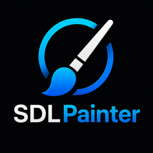
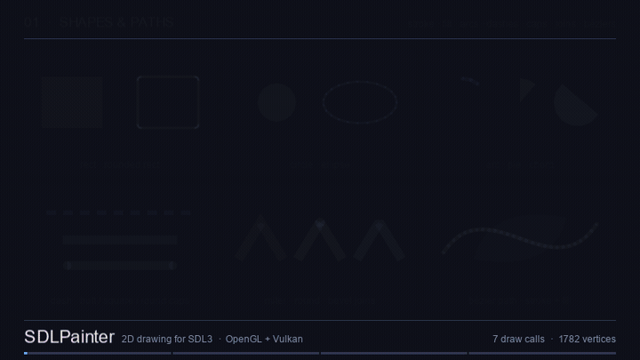
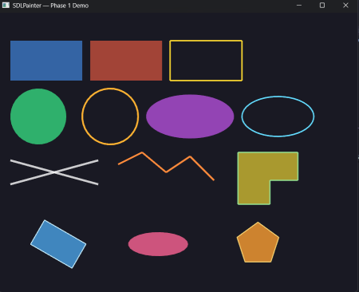
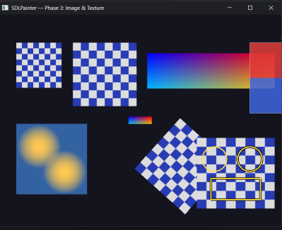
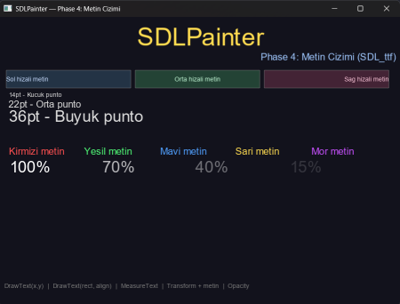
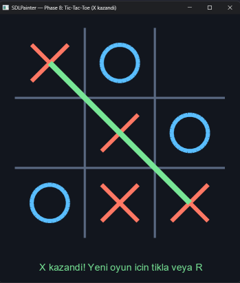
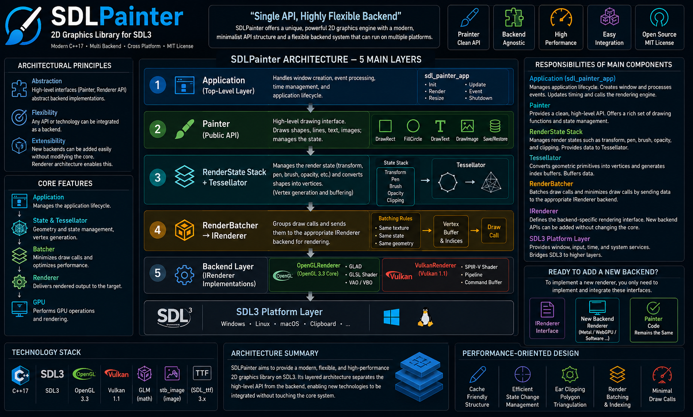

[Türkçe](README.tr.md) | **English**

<div align="center">
  
  <h1>SDLPainter</h1>
  <p><strong>A C++17 2D drawing library for SDL3 with dual OpenGL/Vulkan backends.</strong></p>
  <p>
    <a href="https://github.com/yazilimperver/sdl-painter/actions/workflows/ci.yml"></a>
    <a href="https://github.com/yazilimperver/sdl-painter/releases/latest"></a>
    <a href="https://yazilimperver.github.io/sdl-painter"></a>
    <a href="LICENSE"></a>
  </p>
  <p>
    
    
    
    
  </p>
</div>



> SDLPainter is an independent community project. It is not affiliated with, nor
> endorsed by, the SDL team.

## Why SDLPainter?

SDL3 gives you the window, the input and a capable triangle-level renderer.
SDLPainter adds the layer above it — thick-line geometry, polygon
triangulation, adaptive tessellation, a transform stack and batching — so you
can think in **shapes** instead of vertices.

- **One API, two backends** — the same code produces the same result on OpenGL
  3.3 and Vulkan 1.1; switching is a one-line change, and adding a third backend
  means implementing `IRenderer` only.
- **Correct geometry** — thick lines are quad-based rather than `glLineWidth`
  (consistent across platforms), concave polygons are filled via ear clipping,
  and circle segment counts adapt to the radius.
- **Batches draw calls** — `RenderBatcher` merges draws sharing
  mode/texture/opacity, so thousands of small shapes stay cheap.
- **Optional application framework** — `sdl_painter_app` also gives you the
  window, event loop and timing; skip it entirely if you don't want it.
- **Familiar API** — if you have used QPainter, most of this will feel like home:
  `DrawRect`, `FillCircle`, `Save`/`Restore`.

## Installation

### CMake — `find_package`

Build and install SDLPainter once (see [Building](doc/building.md)), then:

```cmake
find_package(sdl_painter CONFIG REQUIRED)

target_link_libraries(my_app PRIVATE sdl_painter::sdl_painter)
```

Point CMake at the install prefix with `-DCMAKE_PREFIX_PATH=/path/to/prefix`.

### CMake — `FetchContent`

```cmake
include(FetchContent)

FetchContent_Declare(sdl_painter
    GIT_REPOSITORY https://github.com/yazilimperver/sdl-painter.git
    GIT_TAG        v1.2.0)

# Don't build the demos and unit tests as part of your project.
set(SDLPAINTER_BUILD_EXAMPLES OFF)
set(SDLPAINTER_BUILD_TESTS    OFF)

FetchContent_MakeAvailable(sdl_painter)

target_link_libraries(my_app PRIVATE sdl_painter::sdl_painter)
```

Both routes expose the **same target names**, so the snippets are
interchangeable. The optional window/event-loop/timing layer is a separate
target ([ADR-008](adr/ADR-008-application-framework-layer.md)):

```cmake
target_link_libraries(my_app PRIVATE sdl_painter::app)
```

On **Windows**, SDL3 and its dependencies are shared libraries and must sit next
to your executable or the program exits with `0xC0000135` — see
[Deploying runtime DLLs](doc/building.md#deploying-runtime-dlls-windows). By the way, cmake script already copies given files.

SDLPainter is **not on Conan Center yet** — Conan is currently used only to
resolve SDLPainter's own dependencies when building from source.

## Quick example

```cpp
sdl_painter::Painter painter(window, sdl_painter::RendererBackend::kOpenGL);

painter.Begin();
painter.Clear({30, 30, 30, 255});

painter.SetPen(sdl_painter::Pen({255, 0, 0, 255}, 2.0f));
painter.SetBrush(sdl_painter::Brush({100, 100, 255, 128}));
painter.DrawCircle(400, 300, 80);

painter.Save();
painter.Translate(400, 300);
painter.Rotate(45.0f);
painter.DrawRect(-50, -50, 100, 100);
painter.Restore();

painter.End();
```

To build the repository itself and run your first demo:

```bash
conan install . --output-folder=build/linux-debug/generators --build=missing -s build_type=Debug

cmake --preset linux-debug && cmake --build --preset linux-debug
./build/linux-debug/examples/primitives
```

Full instructions: [Building from source](doc/building.md).

## Gallery

| | |
|:---:|:---:|
|  |  |
| **Basic primitives** — stroke/fill, thick lines, concave polygon (`primitives`) | **Image / texture** — scaling, atlas slicing, rotation (`images`) |
|  |  |
| **Text** — SDL_ttf, alignment, layout inside a rect (`text`) | **Application framework** — tic-tac-toe via `sdl_painter_app` (`tictactoe`) |

Sixteen runnable demos (for the time being), one capability each:
[examples/README.md](examples/README.md).

## Features

| Area | Supported |
|------|-----------|
| **Primitives** | Line, rectangle, circle, ellipse, polygon, polyline — all with stroke + fill |
| **Styles** | Pen (color, width, outline), Brush (fill color), global opacity |
| **Transform** | `Translate` / `Rotate` / `Scale`, `Save`/`Restore` stack |
| **Clipping** | Scissor-based rectangular clipping |
| **Image** | PNG / JPG loading (stb_image), source→destination scaling, alpha blending |
| **Text** | SDL_ttf 3.x, glyph cache, left/center/right alignment |
| **Backend** | OpenGL 3.3 Core and Vulkan 1.1 — interchangeable through `IRenderer` |

## Is SDLPainter for you?

**A good fit if** you have an SDL3 application, you want to draw shapes rather
than assemble triangles, you want a type-safe modern C++ API, or you want the
Vulkan backend and the ability to plug in your own.

**Look elsewhere if** you need paths, béziers or gradients, top-quality
anti-aliasing, or D3D/Metal backends.

### How it relates to SDL_Renderer

SDL3's `SDL_Renderer` draws arbitrary triangles through `SDL_RenderGeometry`,
picks a backend per platform. SDLPainter takes on the shape-level work you would otherwise write yourself:

| Need | Written by hand | With SDLPainter |
|---|---|---|
| A 3 px thick line | Compute the normal, build a quad, emit 2 triangles | `SetPen(Pen(color, 3.0F)); DrawLine(...)` |
| Fill a concave polygon | A triangle fan is not enough → write ear clipping | `FillPolygon(points)` |
| A smooth circle at any radius | Tune the segment count by hand, build the fan | `FillCircle(cx, cy, r)` — segments adapt |
| Rotate a group of shapes | Multiply the vertices yourself | `Save(); Rotate(45); …; Restore()` |
| 5,000 small shapes | Group them and merge draw calls by hand | `RenderBatcher` does it |

## Architecture



Five layers, each with a single responsibility:

1. **Application** *(optional)* — window, event loop, timing ([ADR-008](adr/ADR-008-application-framework-layer.md))
2. **Painter** — public API; collects drawing commands and applies the current state
3. **RenderState + Tessellator** — transform/pen/brush/opacity/clip stack; turns shapes into vertices. The transform is a 3×3 affine `glm::mat3`, column-major ([ADR-007](adr/ADR-007-glm-transform-matrix.md))
4. **RenderBatcher → IRenderer** — merges draw calls and forwards them to the backend
5. **Backend** — `OpenGLRenderer` / `VulkanRenderer` on top of the SDL3 platform layer

Adding a backend only requires implementing `IRenderer`; Painter code stays
untouched. Every decision that shaped these layers is recorded as an
[Architecture Decision Record](adr/README.md).

## Supported platforms

| Platform | Toolchain | OpenGL | Vulkan |
|---|---|:---:|:---:|
| Linux | GCC / Clang | ✅ | ✅ |
| Windows | MSVC (VS 2022) | ✅ | ✅ |
| Windows | MinGW cross-compile from Linux | ✅ | ❌ |
| Android | — | ❌ | ❌ |
| macOS | — | ❌ | ❌ |

## Documentation

| | |
|---|---|
| [API reference (Doxygen)](https://yazilimperver.github.io/sdl-painter) | Generated from the public headers on every push to `main` |
| [Building from source](doc/building.md) | Prerequisites, presets, CMake options, Docker |
| [Script reference](doc/scripts.md) | `build` / `conan-install` / `run-tests` / `format-check` |
| [Development](doc/development.md) | Directory layout, quality checks, CI/CD |
| [Examples](examples/README.md) | What each demo shows |
| [Getting Started](doc/getting-started.md) | Setup, presets, first application, troubleshooting |
| [Architecture Overview](doc/architecture.md) | Layers, dependencies, data flow, invariants |
| [Architecture Decision Records](adr/README.md) | Why the design is what it is |
| [Overview infographic](doc/sdl-painter-general-overview-english.png) | One-page visual summary of the library |

Design documents are currently only in **Turkish**, as are the diagrams:
[Feature List](doc/sdl-painter-ozellikler.md) ·
[Examples Guide](doc/sdl-painter-ornekler.md) ·
[Class Diagrams](doc/sinif-diyagrami.md) · [Flow Diagrams](doc/akislar.md) ·
[Backend Internals](doc/backend-ic-yapisi.md) ·
[Software Engineering](doc/sdl-painter-yazilim-muhendisligi.md) ·
[Documentation Guide](doc/dokumantasyon-rehberi.md) ·
[Docker Guide](doc/docker.md) ·
[Publishing to Docker Hub](doc/docker-hub-deployment.md)

I will translate them as soon as possible.

## Contributing

Issues and pull requests are welcome — see [CONTRIBUTING.md](CONTRIBUTING.md)
for the commit format, branch strategy and when an ADR is required. Formatting
is enforced by CI; run `./scripts/format-check.sh --fix` before pushing.

Changes are tracked in [CHANGELOG.md](CHANGELOG.md).

## License

MIT — see [LICENSE](LICENSE).
