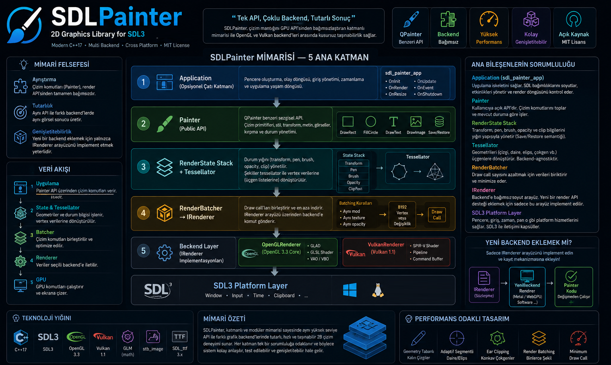

**Türkçe** | [English](README.md)

<div align="center">
  
  <h1>SDLPainter</h1>
  <p><strong>SDL3 + OpenGL/Vulkan dual backend destekli C++17 2B çizim kütüphanesi.</strong></p>
  <p>
    <a href="https://github.com/yazilimperver/sdl-painter/actions/workflows/ci.yml"></a>
    <a href="https://github.com/yazilimperver/sdl-painter/releases/latest"></a>
    <a href="https://yazilimperver.github.io/sdl-painter"></a>
    <a href="LICENSE"></a>
  </p>
  <p>
    
    
    
    
  </p>
</div>


> SDLPainter bağımsız bir topluluk projesidir; SDL ekibiyle bir ilişkisi yoktur ve
> SDL ekibi tarafından onaylanmamıştır.

## Neden SDLPainter?

`SDL_RenderGeometry` size **üçgen** verir; ihtiyacınız olan şey **şekil**.
SDLPainter tam bu boşluğu doldurur — kalın çizgi geometrisi, poligon
triangulation'ı, adaptif tessellation, transform stack ve batching'i bir kez ve
doğru şekilde yazar.

- **Tek API, iki backend** — Aynı kod OpenGL 3.3 ve Vulkan 1.1'de aynı sonucu
  üretir; backend değiştirmek tek satır, üçüncüsünü eklemek yalnızca `IRenderer`
  implemente etmek demek.
- **Doğru geometri** — Kalın çizgiler `glLineWidth` yerine quad tabanlı
  (platformlar arası tutarlı), konkav çokgenler ear clipping ile doğru
  dolduruluyor, daire segment sayısı yarıçapa göre uyarlanıyor.
- **Draw call'ları biriktirir** — `RenderBatcher` aynı mod/texture/opacity'deki
  çizimleri birleştirir; binlerce küçük şekil ucuzlar.
- **İsteğe bağlı uygulama çatısı** — `sdl_painter_app` ile pencere, olay döngüsü
  ve zamanlama da hazır gelir; istemezseniz hiç kullanmayın.
- **Tanıdık API** — QPainter kullandıysanız çoğu şey tanıdık gelecek:
  `DrawRect`, `FillCircle`, `Save`/`Restore`.

## Kurulum

### CMake — `find_package`

SDLPainter'ı bir kez derleyip kurun ([Hızlı Başlangıç](doc/hizli-baslangic.md)),
sonra:

```cmake
find_package(sdl_painter CONFIG REQUIRED)

target_link_libraries(my_app PRIVATE sdl_painter::sdl_painter)
```

CMake'i kurulum dizinine `-DCMAKE_PREFIX_PATH=/kurulum/yolu` ile yönlendirin.

### CMake — `FetchContent`

```cmake
include(FetchContent)

FetchContent_Declare(sdl_painter
    GIT_REPOSITORY https://github.com/yazilimperver/sdl-painter.git
    GIT_TAG        v1.1.0)   # tekrarlanabilir derleme için sürüm etiketine sabitleyin

# Demoları ve birim testleri kendi projenizin parçası olarak derlemeyin.
set(SDLPAINTER_BUILD_EXAMPLES OFF)
set(SDLPAINTER_BUILD_TESTS    OFF)

FetchContent_MakeAvailable(sdl_painter)

target_link_libraries(my_app PRIVATE sdl_painter::sdl_painter)
```

Her iki yol da **aynı hedef isimlerini** sunar; parçalar birbirinin yerine
kullanılabilir. Opsiyonel pencere / olay döngüsü / zamanlama katmanı ayrı bir
hedeftir ([ADR-008](adr/ADR-008-application-framework-layer.md)):

```cmake
target_link_libraries(my_app PRIVATE sdl_painter::app)
```

**Windows'ta** SDL3 ve bağımlılıkları shared kütüphanedir; executable'ınızın
yanında olmazlarsa program `0xC0000135` ile kapanır — bkz.
[Çalışma zamanı DLL'leri](doc/building.md#deploying-runtime-dlls-windows)
*(İngilizce)*.

SDLPainter **henüz Conan Center'da değil** — Conan şu an yalnızca SDLPainter'ın
*kendi* bağımlılıklarını çözmek için kullanılıyor.

## Kısa örnek

```cpp
sdl_painter::Painter painter(window, sdl_painter::RendererBackend::kOpenGL);

painter.Begin();
painter.Clear({30, 30, 30, 255});

painter.SetPen(sdl_painter::Pen({255, 0, 0, 255}, 2.0f));
painter.SetBrush(sdl_painter::Brush({100, 100, 255, 128}));
painter.DrawCircle(400, 300, 80);

painter.Save();
painter.Translate(400, 300);
painter.Rotate(45.0f);
painter.DrawRect(-50, -50, 100, 100);
painter.Restore();

painter.End();
```

Reponun kendisini derleyip ilk demoyu çalıştırmak için:

```bash
conan install . --output-folder=build/linux-debug/generators --build=missing -s build_type=Debug
cmake --preset linux-debug && cmake --build --preset linux-debug
./build/linux-debug/examples/primitives
```

Ayrıntılı anlatım: [Hızlı Başlangıç Rehberi](doc/hizli-baslangic.md).

## Örnek Ekran Görüntüleri

| | |
|:---:|:---:|
|  |  |
| **Temel primitifler** — stroke/fill, kalın çizgiler, konkav poligon (`primitives`) | **Image / texture** — ölçekleme, atlas dilimleme, döndürme (`images`) |
|  |  |
| **Metin** — SDL_ttf, hizalama, rect içine yerleştirme (`text`) | **Uygulama çatısı** — `sdl_painter_app` ile tic-tac-toe (`tictactoe`) |

Her biri tek bir yeteneği izole eden on beş çalışan demo:
[Örnekler Rehberi](doc/sdl-painter-ornekler.md).

## Özellikler

| Alan | Desteklenen |
|------|-------------|
| **Primitifler** | Çizgi, dikdörtgen, daire, elips, çokgen, polyline — hepsi stroke + fill |
| **Stiller** | Pen (renk, kalınlık, outline), Brush (dolgu rengi), global opacity |
| **Transform** | `Translate` / `Rotate` / `Scale`, `Save`/`Restore` yığını — QPainter semantiği |
| **Clipping** | Scissor tabanlı dikdörtgen kırpma |
| **Image** | PNG / JPG yükleme (stb_image), kaynak→hedef ölçekleme, alpha blending |
| **Metin** | SDL_ttf 3.x, glyph cache, left/center/right hizalama |
| **Backend** | OpenGL 3.3 Core ve Vulkan 1.1 — `IRenderer` ile değiştirilebilir |

v1 kapsamı dışında: path ve bezier, gradient, analitik anti-aliasing (yalnızca
MSAA var), path tabanlı clipping. Ayrıntılı liste:
[Özellik Listesi](doc/sdl-painter-ozellikler.md).

## SDLPainter size uygun mu?

**Uygun:** SDL3 uygulamanız varsa, üçgen birleştirmek yerine şekil çizmek
istiyorsanız, tip güvenli modern C++ bir API istiyorsanız ya da Vulkan
backend'ine ve kendi backend'inizi ekleyebilmeye ihtiyacınız varsa.

**Başka yere bakın:** Path, bezier veya gradient gerekiyorsa; üst düzey
anti-aliasing arıyorsanız; D3D/Metal backend'i şartsa.

### SDL_Renderer ile karşılaştırma

SDL3'ün `SDL_Renderer`'ı çok gelişti: `SDL_RenderGeometry` keyfi üçgen
çizebiliyor, backend'i platforma göre kendisi seçiyor, sıfır ek bağımlılık
istiyor ve SDL ekibi tarafından bakılıyor. **Birçok proje için doğru cevap
odur.** Fark, üçgenlerin bitip şekillerin başladığı yerde ortaya çıkıyor:

| İhtiyaç | `SDL_Renderer` ile | SDLPainter ile |
|---|---|---|
| 3 px kalınlığında çizgi | Normal vektör hesapla, quad kur, 2 üçgen üret | `SetPen(Pen(color, 3.0F)); DrawLine(...)` |
| Konkav poligon doldur | Triangle fan yetmez → ear clipping yaz | `FillPolygon(points)` |
| Yarıçapa göre pürüzsüz daire | Segment sayısını elle ayarla, fan kur | `FillCircle(cx, cy, r)` — segment adaptif |
| Döndürülmüş bir grup şekil | Vertex'leri elle çarp | `Save(); Rotate(45); …; Restore()` |
| 5.000 küçük şekil | Elle grupla, draw call'ları birleştir | `RenderBatcher` otomatik yapar |

Dürüst maliyeti de var: `SDL_Renderer` D3D11/D3D12/Metal'i de destekliyor,
SDLPainter desteklemiyor. Path, gradient ve analitik anti-aliasing istiyorsanız
NanoVG daha iyi araç — SDLPainter bunları Vulkan backend'i, modern C++ API'si ve
gerçek paket yöneticisi entegrasyonu karşılığında takas ediyor.

## Mimari



Beş katman, her biri tek bir sorumluluğa odaklı:

1. **Application** *(opsiyonel)* — pencere, olay döngüsü, zamanlama ([ADR-008](adr/ADR-008-application-framework-layer.md))
2. **Painter** — public API; çizim komutlarını toplar, güncel state'i uygular
3. **RenderState + Tessellator** — transform/pen/brush/opacity/clip yığını; şekilleri vertex'e çevirir. Transform 3×3 affine `glm::mat3`, column-major ([ADR-007](adr/ADR-007-glm-transform-matrix.md))
4. **RenderBatcher → IRenderer** — draw call'ları birleştirip backend'e iletir
5. **Backend** — `OpenGLRenderer` / `VulkanRenderer`, SDL3 platform katmanı üzerinde

Yeni bir backend eklemek yalnızca `IRenderer`'ı implemente etmeyi gerektirir;
Painter kodu değişmez. Bu katmanları şekillendiren her karar bir
[Mimari Karar Kaydı](adr/README.md) olarak tutuluyor.

## Desteklenen platformlar

| Platform | Araç zinciri | OpenGL | Vulkan |
|---|---|:---:|:---:|
| Linux | GCC / Clang | ✅ | ✅ |
| Windows | MSVC (VS 2022) | ✅ | ✅ |
| Windows | Linux'ta MinGW cross-compile | ✅ | ❌ |
| macOS | — | ❌ | ❌ |

macOS şimdilik bilinçli olarak kapsam dışı; `conanfile.py` derlemenin ilerleyen
adımlarında patlamak yerine `validate()` içinde açıkça reddediyor.

## Dokümantasyon

| | |
|---|---|
| [API referansı (Doxygen)](https://yazilimperver.github.io/sdl-painter) | Public header'lardan üretiliyor, her `main` push'unda güncelleniyor |
| [Hızlı Başlangıç](doc/hizli-baslangic.md) | Kurulum, preset'ler, CMake seçenekleri, sorun giderme |
| [Örnekler Rehberi](doc/sdl-painter-ornekler.md) | Her demonun ne gösterdiği |
| [Mimari Karar Kayıtları](adr/README.md) | Tasarımın neden böyle olduğu |
| [Genel bakış infografiği](doc/sdl-painter-general-overview.png) | Kütüphanenin tek sayfalık görsel özeti |
| [Mimari Genel Bakış](doc/mimari-genel-bakis.md) | Katmanlar, bağımlılıklar, veri akışı, değişmezler |
| [Derleme](doc/building.md) · [Script'ler](doc/scripts.md) · [Geliştirme](doc/development.md) | Önkoşullar, Docker, script referansı, kalite kontrolleri, CI/CD *(İngilizce)* |

Diğer tasarım dokümanları:
[Özellik Listesi](doc/sdl-painter-ozellikler.md) ·
[Sınıf Diyagramları](doc/sinif-diyagrami.md) ·
[Akış Diyagramları](doc/akislar.md) ·
[Backend İç Yapısı](doc/backend-ic-yapisi.md) ·
[Yazılım Mühendisliği](doc/sdl-painter-yazilim-muhendisligi.md) ·
[Dokümantasyon Rehberi](doc/dokumantasyon-rehberi.md) ·
[Docker Rehberi](doc/docker.md) ·
[Docker Hub'a Yayınlama](doc/docker-hub-deployment.md)

## Katkı

Issue ve pull request'ler açıktır — commit formatı, branch stratejisi ve ADR'nin
ne zaman zorunlu olduğu için [CONTRIBUTING.md](CONTRIBUTING.md). Format kontrolü
CI'da zorunlu; push'tan önce `./scripts/format-check.sh --fix` çalıştırın.

Değişiklikler [CHANGELOG.md](CHANGELOG.md) içinde izleniyor.

## Lisans

MIT — bkz. [LICENSE](LICENSE).
