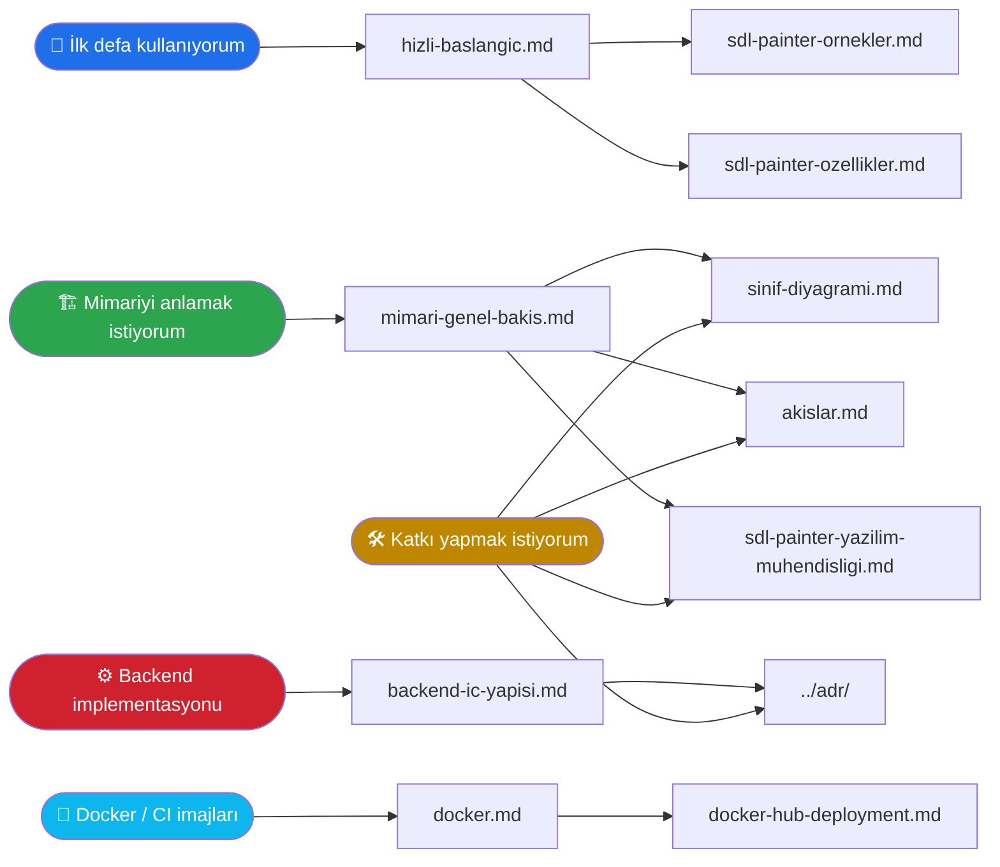

# SDLPainter — Dokümantasyon

QPainter benzeri, SDL3 + OpenGL/Vulkan dual backend destekli C++ 2B
çizim kütüphanesinin teknik dokümantasyonu.

---

## 📚 Doküman Haritası

---

## 📖 Dokümanlar

### Başlangıç

| Doküman | İçerik |
|---------|--------|
| 🚀 [Hızlı Başlangıç](hizli-baslangic.md) · [Getting Started](getting-started.md) | Önkoşullar, kurulum, ilk uygulama, sık sorunlar |
| 📝 [Özellik Listesi](sdl-painter-ozellikler.md) | Desteklenen primitifler, stiller, backend'ler |
| 💡 [Örnekler](sdl-painter-ornekler.md) · [examples/README.md](../examples/README.md) | Kullanım örnekleri ve kod parçaları |
| 🔧 [Building](building.md) · [Scripts](scripts.md) · [Development](development.md) | Derleme, Docker, script referansı, kalite kontrolleri, CI/CD *(İngilizce)* |

### Mimari

| Doküman | İçerik |
|---------|--------|
| 🏗️ [Mimari Genel Bakış](mimari-genel-bakis.md) · [Architecture](architecture.md) | Katmanlar, bileşen bağımlılıkları, kaynak ağacı, sözleşmeler |
| 🧩 [Sınıf Diyagramı](sinif-diyagrami.md) | UML class diagram (Mermaid) — Painter, render hattı, görseller, backend'ler |
| 🔄 [Akış Diyagramları](akislar.md) | Frame yaşam döngüsü, draw call, batch flush, transform stack, texture upload, Vulkan frame |
| 🏛️ [Yazılım Mühendisliği Perspektifi](sdl-painter-yazilim-muhendisligi.md) | Tasarım kararlarının gerekçeleri, SOLID, kapsam yönetimi |

### Backend Detayı

| Doküman | İçerik |
|---------|--------|
| ⚙️ [Backend İç Yapısı](backend-ic-yapisi.md) | OpenGL 3.3 ve Vulkan 1.1 implementasyonu, karşılaştırma, yeni backend ekleme |

### Docker ve Dağıtım

| Doküman | İçerik |
|---------|--------|
| 🐳 [Docker Kullanım Kılavuzu](docker.md) | İmaj hiyerarşisi, builder/ci/windows-cross aşamaları, GitLab CI entegrasyonu, Dockerfile.windows |
| 📦 [Docker Hub'a Dağıtım](docker-hub-deployment.md) | İmaj build, etiketleme, Hub/GitLab Registry'ye push, otomatik CI/CD akışı |

### Katkı ve Dokümantasyon

| Doküman | İçerik |
|---------|--------|
| 📝 [Dokümantasyon Rehberi](dokumantasyon-rehberi.md) | Doxygen yorum standardı, etiket kullanımı, yerel build, GitLab Pages |

### Karar Kayıtları

| Doküman | İçerik |
|---------|--------|
| 📜 [ADR Dizini](../adr/) | Architecture Decision Records — neden böyle yapıldı? |

---

## 🎯 Sık Sorulan Sorular

**1. QPainter biliyorum, SDLPainter'a nasıl geçerim?**
→ [Hızlı Başlangıç](hizli-baslangic.md). API büyük ölçüde aynı; `Save`/`Restore`,
`SetPen`/`SetBrush`, `DrawRect`/`FillRect` semantik olarak özdeş.

**2. OpenGL ve Vulkan arasındaki fark kullanıcı tarafından hissedilir mi?**
→ Hayır. Tek değişiklik constructor argümanı (`RendererBackend::kVulkan`).
Tüm Painter API çağrıları aynı şekilde çalışır. Detay:
[backend-ic-yapisi.md → §4](backend-ic-yapisi.md#4-iki-backendin-aynı-painter-çağrısına-verdiği-yanıt).

**3. Yeni bir backend eklemek istiyorum (örn. DirectX, Metal).**
→ Sadece `IRenderer` arayüzünü implemente etmek yeterli. Detay:
[backend-ic-yapisi.md → §5](backend-ic-yapisi.md#5-backend-eklemek).

**4. Performans nasıl?**
→ `RenderBatcher` aynı state ile gelen draw call'ları **tek bir GPU
çağrısına** birleştirir. 100 aynı renkli `FillRect` = 1 draw call.
Detay: [akislar.md → §3](akislar.md#3-render-batcher-akışı).

**5. Path / Bezier / Gradient destekleniyor mu?**
→ Hayır, v1 kapsam dışı. Gerekçeler:
[sdl-painter-yazilim-muhendisligi.md → Kapsam Yönetimi](sdl-painter-yazilim-muhendisligi.md#kapsam-yönetimi).

---

## 🔗 İlgili Kaynaklar

- **Repo kök dosyaları:** `CMakeLists.txt`, `conanfile.py`, `CMakePresets.json`
- **CI/CD:** `.gitlab-ci.yml`
- **Proje kuralları:** `.claude/CLAUDE.md`, `.claude/rules/*.md`
- **ADR'ler:** `adr/` dizini
- **Demo kodları:** `examples/*.cpp` (bkz. [examples/README.md](../examples/README.md))
- **Birim testler:** `tests/test_*.cpp`

---

## 📐 Diyagram Notasyonu

Tüm diyagramlar **Mermaid** formatındadır:

- ✅ GitHub, GitLab, MkDocs, Obsidian, IntelliJ, VS Code (eklenti) doğrudan render eder
- ✅ Versiyonlanabilir (markdown içinde düz metin)
- ✅ Diff'lenebilir (PR review'da değişiklik görülür)
- ❌ PNG/SVG'ye gerek yok; gerekirse Mermaid CLI ile dışa aktarılabilir

Sınıf diyagramlarında ilişki sembollerinin anlamı için
[sinif-diyagrami.md → §7](sinif-diyagrami.md#7-i̇lişki-türleri-sözlüğü).
