# SDLPainter — Akış Diyagramları

Bu dokümanda SDLPainter'ın **çalışma zamanı davranışını** sequence ve flow
diyagramlarıyla anlatmaya çalıştım. Statik yapı için
[Sınıf Diyagramı](sinif-diyagrami.md), katman bağlamı için
[Mimari Genel Bakış](mimari-genel-bakis.md) dokümanlarına başvurabilirsiniz.

---

## 1. Frame Yaşam Döngüsü

Tipik bir oyun döngüsü iterasyonunda Painter ve renderer'ın izlediği akış:

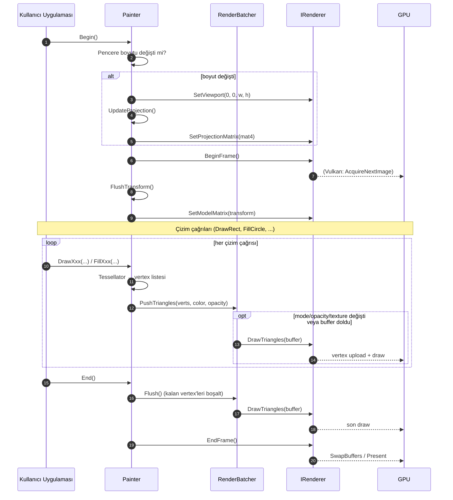

**Önemli sözleşmeler**

- Çizim çağrıları **Begin/End arasında** olmalı; aksi halde tessellator
  vertex üretir ama batcher'da birikir, frame sınırı belirsiz kalır.
- `End()` **garantili `Flush()`** çağırır; uygulama kapanırken kayıp
  vertex olmaz.
- Pencere boyutu değişimi her `Begin()` başında kontrol edilir; manuel
  callback gerekmez.

---

## 2. Tek Bir `DrawRect` Çağrısının Detayı

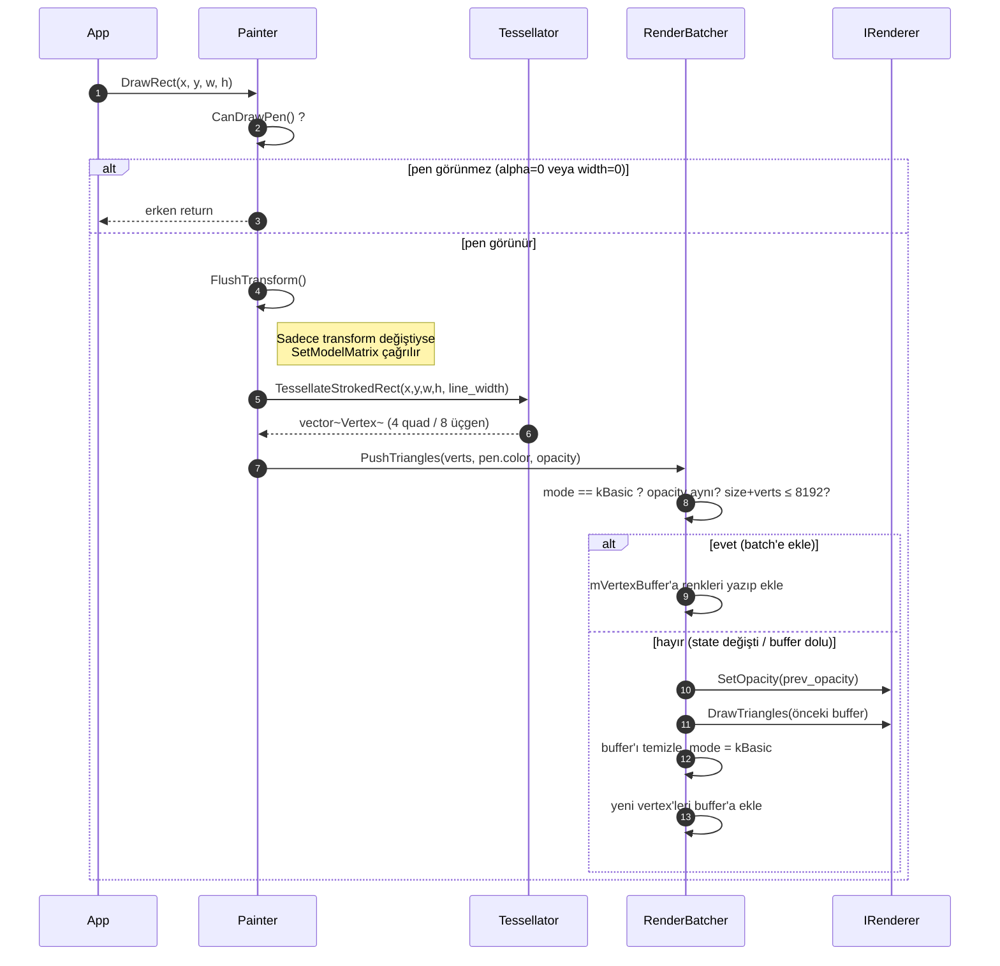

**Kritik nokta:** Tessellator çağrıları **stateless** olduğu için her zaman
deterministiktir. Ölçüm ve test bu sayede GPU gerektirmez (mock IRenderer
ile).

---

## 3. Render Batcher Akışı

`RenderBatcher`'ın iç state machine'i ve `Flush()` tetikleme koşulları:

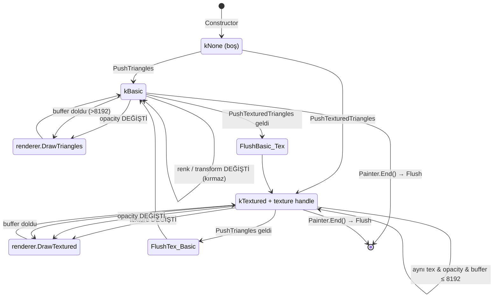

### Flush Tetikleme Koşulları (Tablo)

| Geçiş | Sebep | Sonuç |
|-------|-------|-------|
| kBasic → kBasic | Aynı opacity, buffer < 8192 | **Flush YOK**, vertex eklenir |
| kBasic → kBasic | Opacity değişti | **Flush** + yeni batch başlar |
| kBasic → kBasic | Buffer >8192 vertex olur | **Flush** + yeni batch |
| kBasic → kTextured | Çizim modu değişti | **Flush** + textured batch başlar |
| kTextured → kTextured | Texture değişti | **Flush** + yeni texture batch |
| Painter.SetClipRect / ClearClip | Scissor GPU durumu değişti | **Flush** + yeni scissor |
| Painter.Restore() | Clip durumu **gerçekten** değiştiyse | **Flush** + scissor geri yüklenir |
| Painter.End() | Frame sonu | **Flush** (kalan ne varsa) |
| Painter.Clear() | Ekran temizleme | **Flush** önce, sonra Clear |

**Flush TETİKLEMEYENLER** (sık karıştırılır):

| İşlem | Neden batch'i kırmaz |
|-------|----------------------|
| `SetPen` / `SetBrush` | Renk `Vertex` içinde taşınır, uniform değil |
| `Translate` / `Rotate` / `Scale` / `ResetTransform` | Transform, `RenderBatcher` içinde CPU'da vertex'e uygulanır; model matrisi daima birim |
| `Save()` | Kaydedilen hiçbir şey GPU durumu değil |
| `Restore()` — clip aynıysa | Yalnızca clip değişimi flush gerektirir |
| `SetOpacity` — aynı değere | `SameOpacity()` toleransı (1/512) |

**Pratik etki:** 2000 farklı renkte, her biri kendi `Translate`/`Rotate`'i
olan `FillRect` → **2 draw call** (12 000 vertex, yalnızca 8192 tavanı
yüzünden ikiye bölünür).

Bu tablo tahmin değil, ölçüm sonucudur: senaryo bazlı draw call ve süre
verileri için bkz. **[`examples/benchmarks/README.md`](../examples/benchmarks/README.md)**.
Aynı sayaçlar çalışma zamanında `Painter::GetFrameStats()` ile, `Application`
tabanlı uygulamalarda ise **F1** ile açılan ekran üstü göstergede okunabilir.

---

## 4. Transform Stack — `Save` / `Restore` Mantığı

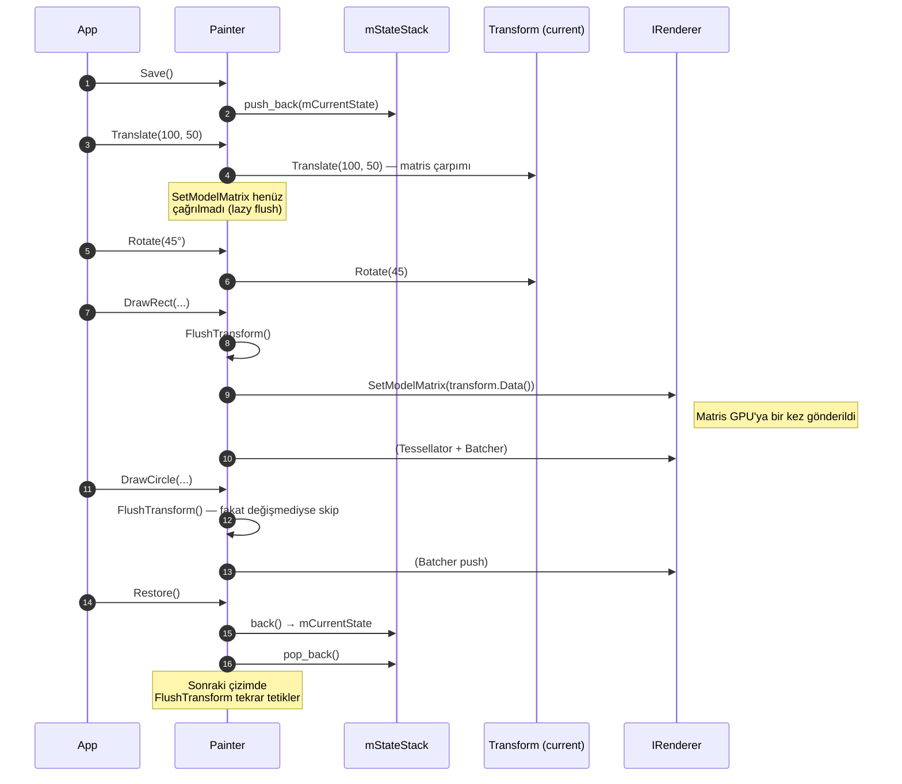

**RenderState ne taşır?** → `transform`, `pen`, `brush`, `opacity`,
`clip_rect`, `has_clip`. `Save()` bunların **tamamının kopyasını** alır;
`Restore()` hepsini geri yükler.

### İç İçe Save/Restore

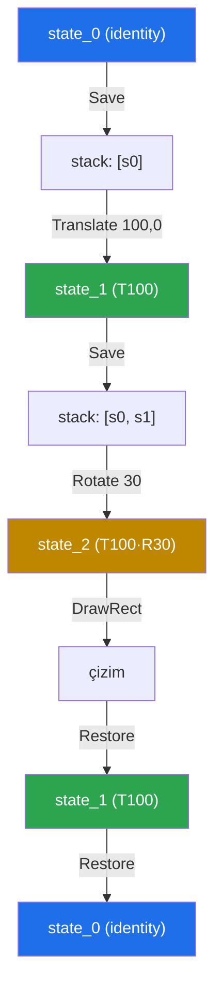

---

## 5. Texture Upload (Image → GPU)

`Image` lazy upload + cache stratejisi kullanır. İlk çağrıda yükler,
sonrakilerde mevcut handle'ı döner.

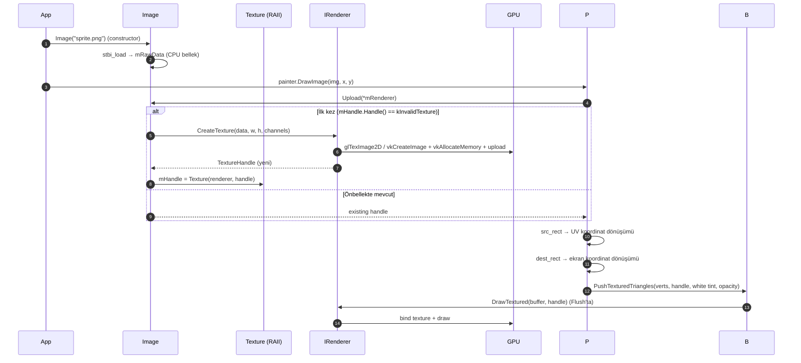

### Image / Texture Yaşam Döngüsü

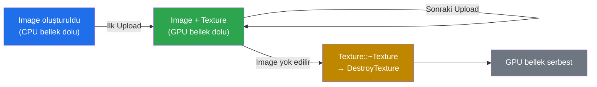

**RAII garantisi:** `Texture` sınıfı non-copyable, movable. Yıkıcı
`DestroyTexture` çağırır → texture sızıntısı imkansız.

---

## 6. Metin Çizimi (Phase 4) — Glyph Cache

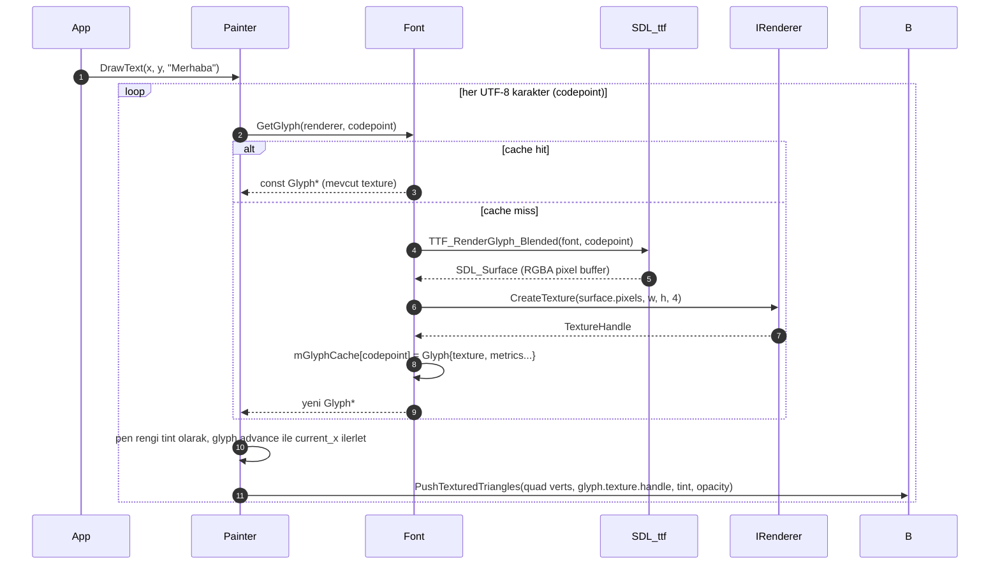

**Optimizasyon:** Glyph cache UTF-8 codepoint bazında çalışır. Türkçe ve
emoji karakterleri ilk render'da maliyet yaratır, sonra parasız döner.

---

## 7. Vulkan Frame Akışı (Phase 5)

OpenGL'de `BeginFrame`/`EndFrame` neredeyse trivialdir; Vulkan'da
swapchain yönetimi, sync nesneleri ve out-of-date kontrolü vardır.

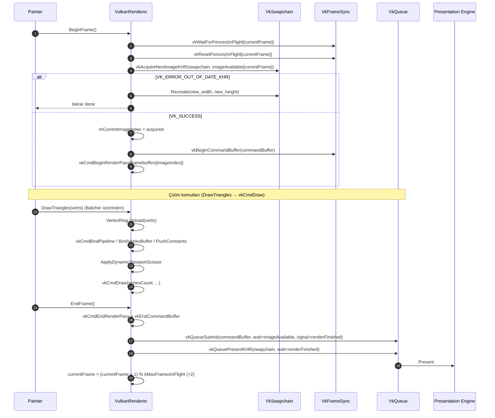

**Out-of-date handling:** Pencere yeniden boyutlandığında swapchain
geçersizleşir. `AcquireNextImage` veya `QueuePresent` `OUT_OF_DATE` döner;
`VulkanRenderer` swapchain'i `Recreate` ile yeniden oluşturur. Painter
bu detaydan haberdar olmaz.

---

## 8. Backend Seçimi (Factory)

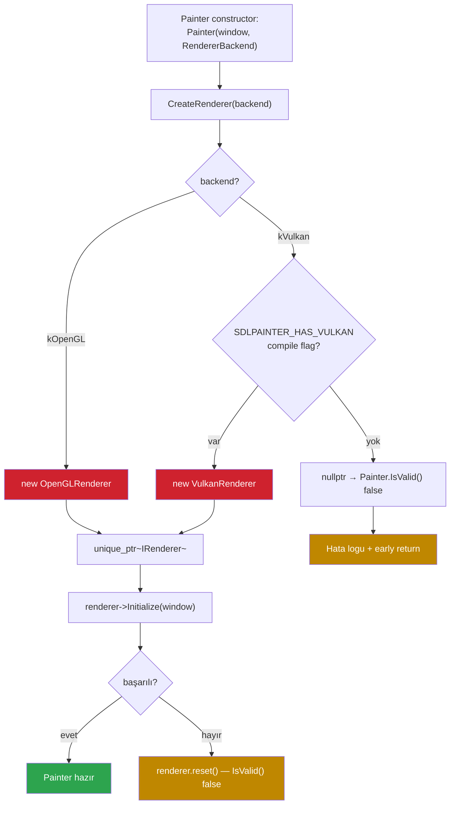

**Sözleşme:** Painter constructor başarısız olabilir; **kullanıcı
`painter.IsValid()` ile kontrol etmek zorundadır**. Exception fırlatılmaz
(C++ tarafında deterministik hata için).

---

## 9. Tessellator İç Akışları

### 9.1 Adaptif Daire Segment Sayısı

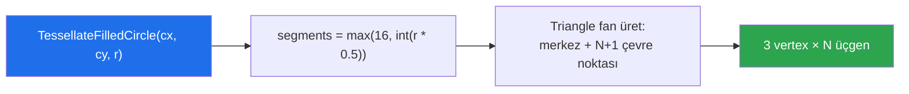

| Yarıçap | Segment | Üçgen | Vertex |
|---------|---------|-------|--------|
| 8 px    | 16      | 16    | 48     |
| 50 px   | 25      | 25    | 75     |
| 200 px  | 100     | 100   | 300    |
| 1000 px | 500     | 500   | 1500   |

### 9.2 Konkav Polygon — Ear Clipping

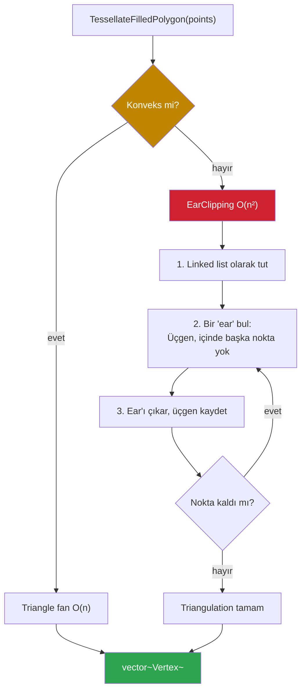

### 9.3 Kalın Çizgi (`glLineWidth` yok)

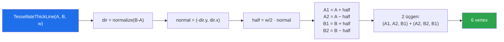

Ortografik projeksiyon altında bu yaklaşım her platformda piksel-tutarlı
sonuç verir; `glLineWidth` ise sürücüye göre değişen üst sınıra sahiptir.

---

## 10. Hatalı Kullanım Senaryoları

| Hata | Etki | Önlem |
|------|------|-------|
| `Begin()` çağırmadan `DrawRect` | Buffer'da birikir, frame sınırı bozulur | API'de assertion (geliştirme) |
| `End()` çağırmadan kapatma | Son batch flush olmaz, son frame bozuk | Painter destructor → Shutdown |
| `Pen({0,0,0,0}, 5.0f)` | `IsVisible()` false → çizim atlanır | Erken return, GPU yükü yok |
| `painter.IsValid()` kontrol etmemek | Renderer init başarısız olduysa null deref | Demo'larda zorunlu kontrol var |
| Aynı `Image`'i çoklu Painter'da `Upload` | Her renderer için ayrı texture | Image bir renderer'a bağlanmalı |
| `Save` sonrası `Restore` unutulmak | `mStateStack` sızar | RAII guard helper önerilir (v2) |
