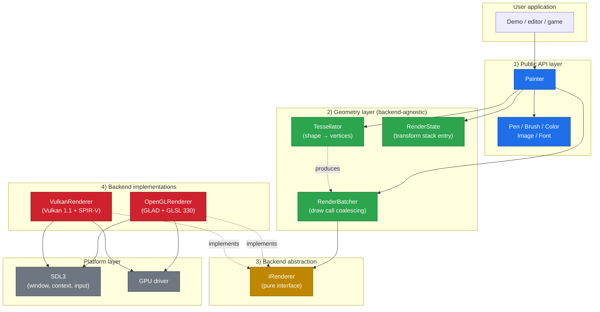
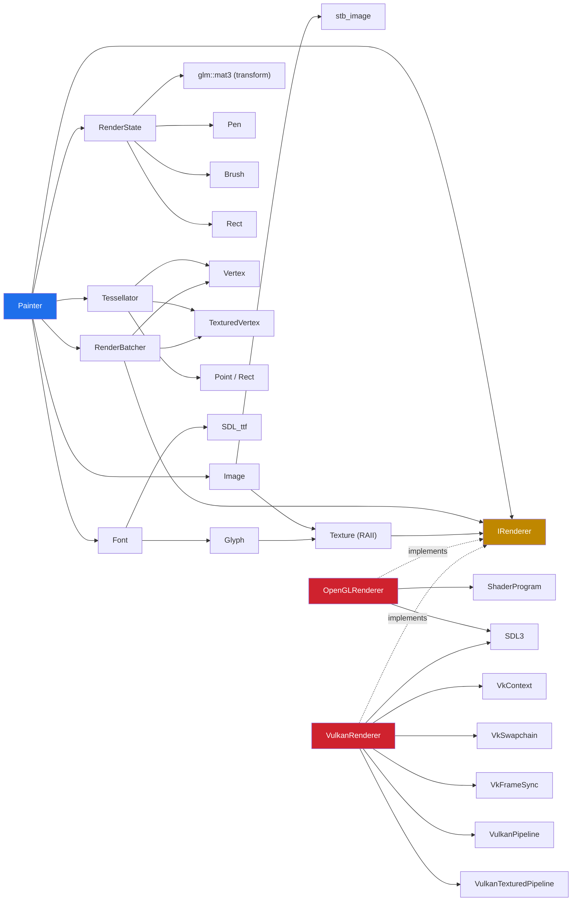
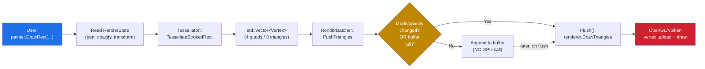
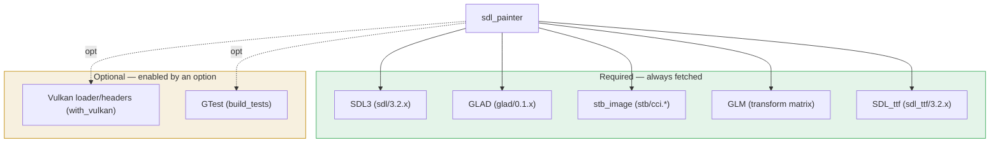

[Türkçe sürüm](mimari-genel-bakis.md) | **English**

# SDLPainter — Architecture Overview

This document describes SDLPainter's **layered architecture**, the
**dependencies between components** and the **flow of data**, from a high
level. For class-level detail see the [Class Diagram](sinif-diyagrami.md); for
runtime sequences see the [Flow Diagrams](akislar.md) *(both in Turkish)*.

---

## 1. The layers

SDLPainter is four independent layers. Each layer depends only on the
**interface** of the one below it, never on a concrete implementation.



### What each layer owns

| Layer | Responsibility | What it does NOT know |
|-------|----------------|-----------------------|
| **Public API** | user-facing API, style and transform state | the GPU, vertex formats, batching |
| **Geometry** | turns shapes into vertices, accumulates draw calls | OpenGL/Vulkan commands |
| **Backend abstraction** | the renderer contract | any implementation detail |
| **Backend impl.** | GPU commands, shaders, buffers, textures | tessellation, style, transform stack |

The concrete pay-off: swapping `OpenGLRenderer` for `VulkanRenderer` means
**changing one constructor argument**. Not a single line changes in `Painter`,
`Tessellator`, `RenderBatcher` or `RenderState`.

---

## 2. Component dependencies

Which component uses which:



> Solid arrows are **direct use**; dashed arrows are **interface
> implementation**.

---

## 3. Data flow: one `DrawRect` call

The path `painter.DrawRect(x, y, w, h)` takes inside the library:



**The point:** in a typical frame many `DrawRect`/`DrawCircle` calls arrive with
the same pen and opacity. `Flush()` is not triggered, and every vertex goes out
in a **single GPU draw call**. Details:
[Flow Diagrams → Batch flush conditions](akislar.md#3-render-batcher-akışı)
*(in Turkish)*.

---

## 4. Module map — source tree

```
sdl-painter/
├── include/sdl_painter/        ← Public API (what the user sees)
│   ├── painter.h               · main drawing class
│   ├── pen.h, brush.h, color.h · style types
│   ├── geometry.h              · Point, Rect, Size
│   ├── image.h, texture.h      · image + RAII texture wrapper
│   ├── font.h                  · SDL_ttf wrapper, Alignment
│   ├── renderer.h              · IRenderer interface + RendererBackend enum
│   ├── version.h               · compile-time version constants
│   └── vertex.h                · Vertex, TexturedVertex
│
├── src/                        ← Implementation (not user-facing)
│   ├── painter.cpp             · API ↔ batcher/tessellator bridge
│   ├── render_batcher.{h,cpp}  · draw call coalescing
│   ├── tessellator.{h,cpp}     · shape → vertices
│   ├── renderer.cpp            · CreateRenderer factory
│   ├── opengl/                 · OpenGL 3.3 backend
│   │   ├── opengl_renderer.{h,cpp}
│   │   ├── shader_program.{h,cpp}
│   │   └── shaders/*.{vert,frag}
│   └── vulkan/                 · Vulkan 1.1 backend
│       ├── vulkan_renderer.{h,cpp}     · IRenderer impl
│       ├── vk_context.{h,cpp}          · instance, device, queue
│       ├── vk_swapchain.{h,cpp}        · swapchain + image views
│       ├── vk_frame_sync.{h,cpp}       · semaphores, fences
│       ├── vk_memory.{h,cpp}           · buffer/image memory
│       ├── vulkan_pipeline.{h,cpp}     · untextured pipeline
│       ├── vulkan_textured_pipeline.{h,cpp}
│       ├── vulkan_buffer.{h,cpp}       · vertex ring buffer
│       ├── vulkan_texture.{h,cpp}      · texture + descriptor set
│       └── shaders/spirv/*.spv         · compiled SPIR-V, embedded at build time
│
├── examples/                   ← demo applications
├── packaging/consumer/         ← external-consumer verification project
└── tests/                      ← GTest unit tests
    ├── mock_renderer.h         · IRenderer mock
    ├── test_tessellator.cpp
    ├── test_render_batcher.cpp
    └── ...
```

Note there is no `transform.h`: the transform is a `glm::mat3` held inside
`RenderState`, not a class of its own
([ADR-007](../adr/ADR-007-glm-transform-matrix.md)).

### Public vs. private

- `include/sdl_painter/*.h` → **public**, with an API/ABI stability goal.
- `src/*.h` (`tessellator.h`, `render_batcher.h`) → **internal**; users must
  not include these.
- `src/opengl/*.h`, `src/vulkan/*.h` → backend-private types.

---

## 5. Dependencies (Conan 2)



With `with_vulkan=False` the Vulkan loader is never downloaded, which keeps CI
time and container images small. See `conanfile.py` and
[Building from source](building.md).

The Vulkan SDK is **not** a build requirement: the compiled SPIR-V lives in the
repository and is embedded into the library, so `glslc` is only needed by people
editing the shader sources ([ADR-009](../adr/ADR-009-embedded-shaders.md)).

---

## 6. Invariants

The rules components rely on to keep the architecture coherent:

| Contract | Meaning |
|----------|---------|
| **Tessellator is stateless** | same input → same output, always. No GPU dependency. |
| **IRenderer is a pure interface** | holds no state (no transform or opacity stack); it only receives commands. |
| **Painter owns its IRenderer** | `unique_ptr<IRenderer>`; its lifetime is the Painter's. |
| **RenderBatcher belongs to Painter** | not reachable from outside; its interface is internal. |
| **Texture handles are opaque** | a `uint32_t` the backend resolves in its own map. |
| **Y grows downward in Painter** | Y = 0 is at the top; the flip for OpenGL's scissor happens in `ApplyScissor`. |
| **Frames are bounded by Begin/End** | state accumulates between the two calls and flushes at `End`. |

Break these and the architecture's benefits — testability, backend
interchangeability, predictable performance — go with them.

---

## 7. Where to go next

- [Class Diagram](sinif-diyagrami.md) — UML classes and relationship types *(in Turkish)*
- [Flow Diagrams](akislar.md) — frame, draw call, transform stack, texture upload *(in Turkish)*
- [Backend Internals](backend-ic-yapisi.md) — OpenGL and Vulkan implementation detail *(in Turkish)*
- [Getting Started](getting-started.md) — your first Painter application
- [Software Engineering Perspective](sdl-painter-yazilim-muhendisligi.md) — the reasoning behind the design *(in Turkish)*
- [Architecture Decision Records](../adr/README.md) — the decisions themselves
