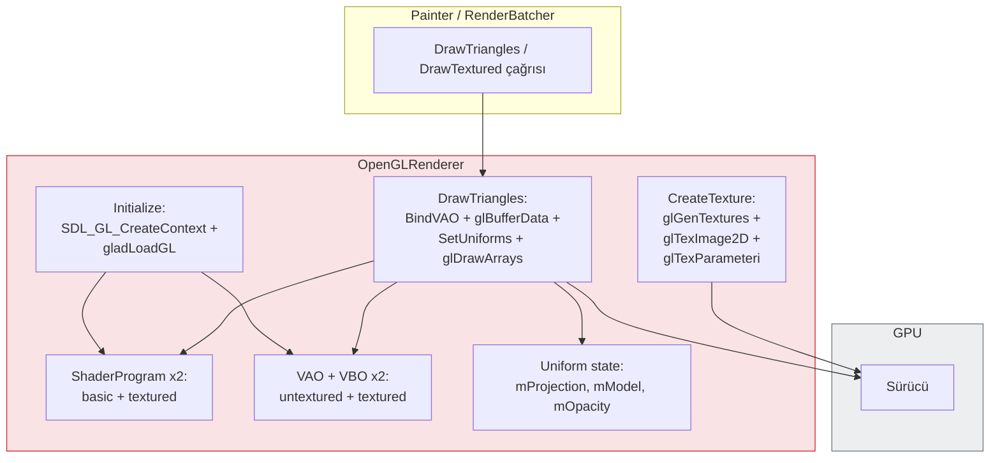
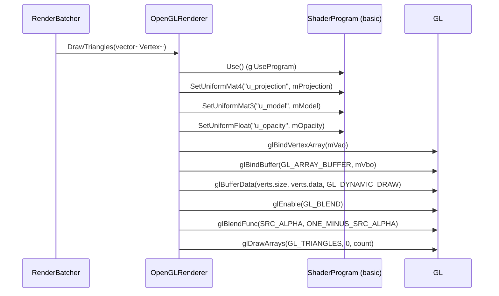
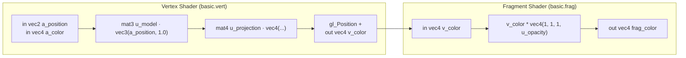
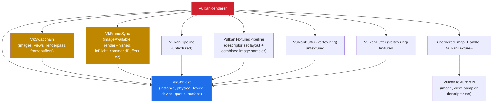
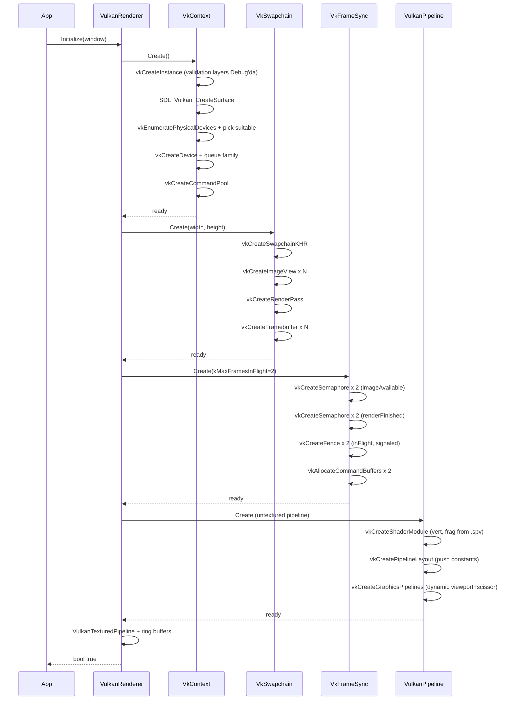
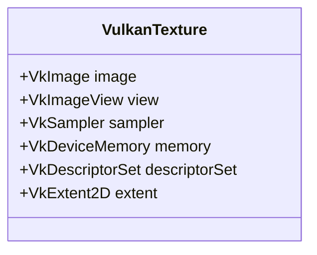
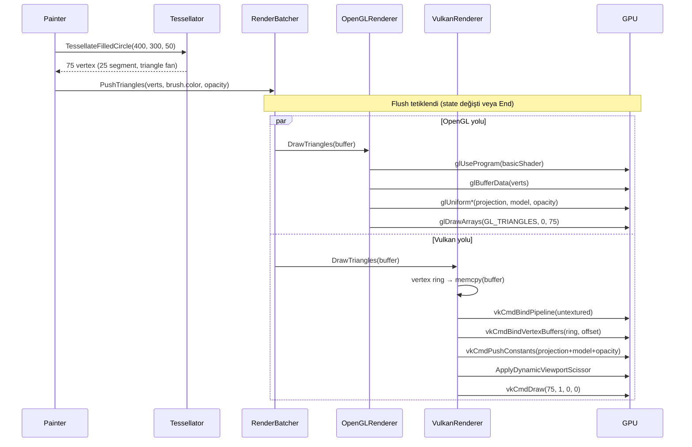
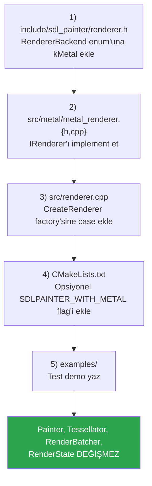

# SDLPainter — Backend İç Yapısı

Bu dokümanda, `IRenderer` arayüzünün arkasındaki **iki somut implementasyonu**
(OpenGL 3.3 ve Vulkan 1.1) detaylı anlatmaya çalışacağım. Üst katman bağlamı için
[Mimari Genel Bakış](mimari-genel-bakis.md), arayüz tanımları için
[Sınıf Diyagramı](sinif-diyagrami.md) dokümanlarına başvurabilirsiniz.

---

## 1. Backend Karşılaştırması

| Konu | OpenGL 3.3 Backend | Vulkan 1.1 Backend |
|------|-------------------|-------------------|
| Initialization karmaşıklığı | Düşük (context + GLAD) | Yüksek (instance/device/swapchain/sync) |
| Frame yapısı | Begin/End trivial | Begin/End: acquire + submit + present |
| Komut gönderimi | Anında (immediate) | Command buffer'a kaydedilir |
| Vertex upload | `glBufferData` her draw | Ring buffer + persistent map |
| Shader | GLSL 330 kaynağı binary'ye gömülü, runtime derlenir | SPIR-V binary'ye gömülü (offline `glslc` ile önceden üretilmiş) |
| Uniform | `glUniform*` | Push constants |
| Pencere boyutu | Otomatik | Swapchain recreate gerekir |
| Sync | Sürücüye bırakılır | Manuel (semaphore + fence) |
| Texture | `glGenTextures` + bind | `VkImage` + `VkImageView` + sampler + descriptor |
| Sahip olunan SDL flag | `SDL_WINDOW_OPENGL` | `SDL_WINDOW_VULKAN` |

**Özet:** OpenGL backend basit ve hızlı bir başlangıç sağlar. Vulkan
backend modern GPU mimarileriyle daha verimli çalışır ve daha fazla
kontrol verir; karşılığında çok daha fazla kod ve dikkat gerektirir.
İkisi de aynı `IRenderer` arayüzünü kullandığı için Painter ikisi
arasında fark görmez.

---

## 2. OpenGL 3.3 Backend

### 2.1 Bileşen Yapısı



### 2.2 Çizim Akışı (`DrawTriangles`)



### 2.3 Shader Programları

İki ayrı program var:

- **basic** — `basic.vert` + `basic.frag`: pozisyon + per-vertex renk
- **textured** — `textured.vert` + `textured.frag`: pozisyon + UV + per-vertex tint



> Renk vertex'te taşındığı için aynı pen/brush dışında bile **tek bir
> draw call** içinde farklı renkli üçgenler çizilebilir. Bu RenderBatcher
> verimliliğinin temel noktalarından biridir.
>
> Aynı husus transform için de geçerlidir. `u_model` shader'da duruyor ama
> `Painter` onu daima **birim** gönderiyor; dönüşüm
> `RenderBatcher::PushTriangles` içinde, rengin yazıldığı kopyalama
> döngüsünde CPU'da uygulanıyor. Böylece `Translate`/`Rotate`/`Scale` de
> batch'i kırmıyor. Ölçüm: 2000 şekil, şekil başına transform ile
> **2000 → 2 draw call**, 9.44 ms → 0.30 ms'e düştüğünü gördük.
> Ayrıntılı sonuçlar ve örnekler için: [`examples/benchmarks/README.md`](../examples/benchmarks/README.md).

### 2.4 Texture İşlemleri

```cpp
// CreateTexture ana hatları
glGenTextures(1, &id);
glBindTexture(GL_TEXTURE_2D, id);
glTexImage2D(GL_TEXTURE_2D, 0, format, w, h, 0, format, GL_UNSIGNED_BYTE, data);
glTexParameteri(GL_TEXTURE_2D, GL_TEXTURE_MIN_FILTER, GL_LINEAR);
glTexParameteri(GL_TEXTURE_2D, GL_TEXTURE_MAG_FILTER, GL_LINEAR);
glTexParameteri(GL_TEXTURE_2D, GL_TEXTURE_WRAP_S, GL_CLAMP_TO_EDGE);
glTexParameteri(GL_TEXTURE_2D, GL_TEXTURE_WRAP_T, GL_CLAMP_TO_EDGE);
return static_cast<TextureHandle>(id);   // GL ID = TextureHandle
```

`TextureHandle` OpenGL backend'de doğrudan GL texture ID'sidir
(`uint32_t`). Vulkan backend'de ise iç haritada çözülen opak bir
sayıdır.

### 2.5 Y Ekseni Dönüşümü

OpenGL pencere koordinatlarında Y=0 **alttadır**; SDLPainter API'sinde
ise Y=0 **üstte**. Painter projeksiyon matrisini buna göre kurar
(`UpdateProjection`):

```
ortho(0, width, height, 0, -1, 1)   // top-left origin
```

Scissor kullanırken ise **OpenGL doğal Y'de** (alttan) ister; bu yüzden
`Painter::ApplyScissor` flip uygular:
```cpp
gl_y = viewport_height - rect.y - rect.h;
glScissor(rect.x, gl_y, rect.w, rect.h);
```

---

## 3. Vulkan 1.1 Backend

### 3.1 Bileşen Hiyerarşisi



### 3.2 Initialize Akışı



### 3.3 Frame Akışı

Detaylar için [Akış Diyagramları → Vulkan Frame](akislar.md#7-vulkan-frame-akışı-phase-5).
Üç önemli detay:

1. **2 frame in flight** — `kMaxFramesInFlight = 2`. CPU bir frame'i
   hazırlarken GPU önceki frame'i çiziyor.
2. **Vertex ring buffer** — `VulkanBuffer` persistent mapped; her
   `DrawTriangles` çağrısında ring içinde ofset ilerletilir, böylece
   memcpy + draw atomik olur.
3. **Push constants** — Projeksiyon, model matrisi ve opacity push
   constants ile gönderilir; descriptor set veya UBO yok.

### 3.4 Push Constants Layout

```cpp
struct PushConstants {
  float projection[16];   // mat4
  float model[9];         // mat3 (gerçekte 12 byte std140 alignment)
  float opacity;
};
```

Toplam ≤ 128 byte (Vulkan minimum garanti). Her draw call'da değişebilir,
descriptor set güncellemesi gerektirmez.

### 3.5 Swapchain Recreate

Pencere yeniden boyutlandığında:

```mermaid
flowchart LR
    A["AcquireNextImage<br/>VK_ERROR_OUT_OF_DATE_KHR"] --> B["mSwapchainOutOfDate = true"]
    B --> C["Recreate akışı:"]
    C --> D["vkDeviceWaitIdle"]
    D --> E["VkSwapchain.Destroy"]
    E --> F["VkSwapchain.Create(new w, new h)"]
    F --> G["Yeni framebuffer'lar"]
    G --> H["mSwapchainOutOfDate = false"]
    H --> I["Frame'i tekrar dene"]

    style A fill:#cf222e,color:#fff
    style I fill:#2da44e,color:#fff
```



`QueuePresentKHR` çağrısı da `OUT_OF_DATE_KHR` veya `SUBOPTIMAL_KHR`
dönebilir; aynı recreate yolu tetiklenir.

### 3.6 Texture Yaşam Döngüsü (Vulkan)

Tek bir `VulkanTexture` aşağıdaki Vulkan nesnelerini kapsar:



Yaratım adımları:

1. `vkCreateImage` (TILING_OPTIMAL)
2. `vkAllocateMemory` + `vkBindImageMemory`
3. **Staging buffer** ile pixel verisini kopyala
4. `vkCmdCopyBufferToImage` (transfer komutu)
5. Layout transition: `UNDEFINED → TRANSFER_DST → SHADER_READ_ONLY`
6. `vkCreateImageView` (RGBA format)
7. `vkCreateSampler` (LINEAR + CLAMP_TO_EDGE)
8. Descriptor set'e bind: `combined image sampler`

Yıkım: yukarıdaki nesnelerin tersi sırada `vkDestroy*`. RAII helper
sınıfları (`vk_raii.h`) bu sırayı garanti eder.

---

## 4. İki Backend'in Aynı Painter Çağrısına Verdiği Yanıt

Aynı `painter.FillCircle(400, 300, 50)` çağrısının iki backend'de
aldığı somut yol:



**Sonuç piksel düzeyinde aynıdır** — tessellation aynı vertex'leri
üretir, projeksiyon matrisleri aynıdır, blend state aynıdır. Tek olası
fark: anti-aliasing yapılandırması (MSAA örnekleme) backend'in pipeline
veya FBO ayarına bağlı olabilir.

---

## 5. Backend Eklemek

Yeni bir backend eklemek (örn. Metal, DirectX 12, Software) için:



Bu **Açık/Kapalı Prensibi**'nin somut karşılığıdır. Bu sayede IRenderer arayüzü
genişlemez ve mevcut backend'ler bu değişiklikten etkilenmez.

---

## 6. İlgili Mimari Karar Kayıtları (ADR)

| ADR | Karar | Bu dokümandaki ilgili bölüm |
|-----|-------|---------------------------|
| ADR-001 | OpenGL 3.3 Core (4.5/ES değil) | §2 |
| ADR-003 | `glLineWidth` yerine geometry quad | Tessellator (akislar.md) |
| ADR-004 | Tessellator backend-agnostic | §4 |
| ADR-005 | stb_image (SDL_image değil) | §2.4 |
| ADR-006 | Ear clipping triangulation | Tessellator (akislar.md) |

---

## 7. Sonraki Adımlar

- [Sınıf Diyagramı → Vulkan Bölümü](sinif-diyagrami.md#5-vulkan-backend-sınıfları)
- [Akış Diyagramları → Vulkan Frame](akislar.md#7-vulkan-frame-akışı-phase-5)
- [Yazılım Mühendisliği Perspektifi](sdl-painter-yazilim-muhendisligi.md)
