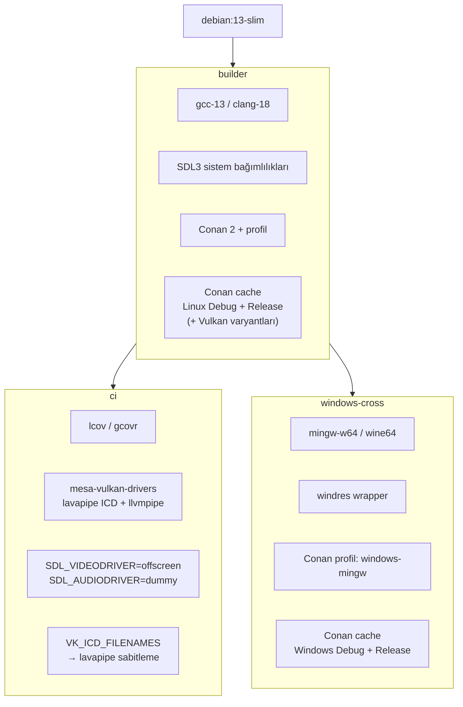
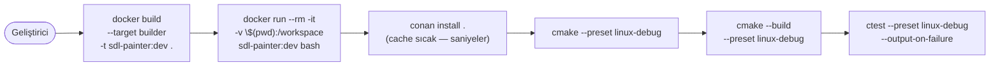
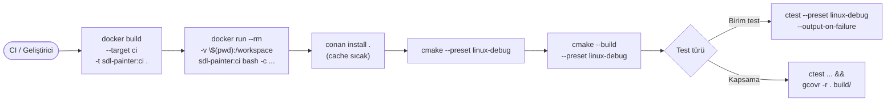
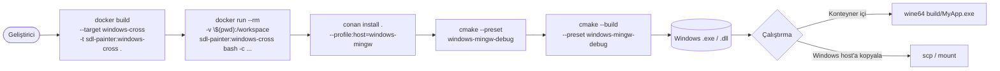
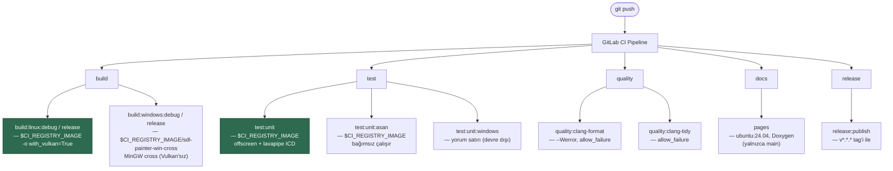
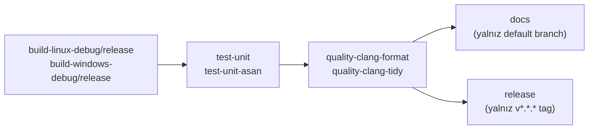

# Docker Aşamaları — Kullanım Kılavuzu

## İmaj Hiyerarşisi



---

## Yerel Geliştirme Akışları

### builder — Linux geliştirme ortamı



```powershell
docker build --target builder -t sdl-painter:dev .
docker run --rm -it -v "${PWD}:/workspace" sdl-painter:dev bash

# Container içinde — conan install atlanamaz: /workspace mount'u imajdaki
# build/ çıktısını gölgeler. Cache (~/.conan2) imajda sıcak olduğundan
# bu adım saniyeler sürer, hiçbir paket yeniden derlenmez.
conan install . --output-folder=build/linux-debug/generators --build=missing \
  -s build_type=Debug -s compiler=gcc -s compiler.version=13 -s compiler.libcxx=libstdc++11
cmake --preset linux-debug
cmake --build --preset linux-debug
```

---

### ci — Headless test ve kod kapsama



```powershell
docker build --target ci -t sdl-painter:ci .

# Debug test
docker run --rm -v "${PWD}:/workspace" sdl-painter:ci bash -c `
  "conan install . --output-folder=build/linux-debug/generators --build=missing -s build_type=Debug -s compiler=gcc -s compiler.version=13 -s compiler.libcxx=libstdc++11 && cmake --preset linux-debug && cmake --build --preset linux-debug && ctest --preset linux-debug --output-on-failure"

# Release test
docker run --rm -v "${PWD}:/workspace" sdl-painter:ci bash -c `
  "conan install . --output-folder=build/linux-release/generators --build=missing -s build_type=Release -s compiler=gcc -s compiler.version=13 -s compiler.libcxx=libstdc++11 && cmake --preset linux-release && cmake --build --preset linux-release && ctest --preset linux-release --output-on-failure"

# Vulkan destekli build + test (lavapipe ile headless)
docker run --rm -v "${PWD}:/workspace" sdl-painter:ci bash -c `
  "conan install . --output-folder=build/linux-release/generators --build=missing -s build_type=Release -s compiler=gcc -s compiler.version=13 -s compiler.libcxx=libstdc++11 -o '&:with_vulkan=True' && cmake --preset linux-release && cmake --build --preset linux-release && ctest --preset linux-release --output-on-failure"
```

---

### windows-cross — Windows cross-compile (Linux host)



```powershell
docker build --target windows-cross -t sdl-painter:windows-cross .

docker run --rm -v "${PWD}:/workspace" sdl-painter:windows-cross bash -c `
  "conan install . --output-folder=build/windows-mingw-debug/generators --build=missing -s build_type=Debug --profile:build=default --profile:host=windows-mingw && cmake --preset windows-mingw-debug && cmake --build --preset windows-mingw-debug"
```

---

## GitLab CI/CD Entegrasyonu

Pipeline, bu repodaki `Dockerfile`'dan üretilip GitLab Container Registry'ye
push'lanan imajları **doğrudan** kullanır. Ayrı bir `.conan_base` template'i
veya `before_script` ile araç kurulumu **yoktur** — araçlar imajda hazır gelir.

| Job | Image | Kaynak |
|---|---|---|
| `build:linux:*`, `test:unit*`, `quality:*` | `$CI_REGISTRY_IMAGE` | `Dockerfile` `ci` / `builder` hedefi |
| `build:windows:*` | `$CI_REGISTRY_IMAGE/sdl-painter-win-cross` | `Dockerfile` `windows-cross` hedefi (Linux + MinGW) |
| `pages` | `ubuntu:24.04` | Conan/CMake gerektirmez, yalnız Doxygen |
| `release:publish` | `release-cli` | `v*.*.*` tag'inde çalışır |



> **Not:** `build:windows:*` job'ları SaaS Windows runner / MSVC **değildir** —
> Linux runner üzerinde MinGW cross-compile imajı (`sdl-painter-win-cross`)
> kullanır ve bu hedefte Vulkan desteklenmez (`conanfile.py configure()`
> otomatik kapatır). Native MSVC build için ayrı `Dockerfile.windows` imajı
> kullanılır (aşağıya bakın).

---

## GitHub Actions Entegrasyonu

Aynı pipeline GitHub Actions'a da taşındı (`.github/workflows/ci.yml`). Linux
job'ları yine bu repodaki `Dockerfile`'dan üretilen imajı kullanır; fark, imajın
GitLab Container Registry yerine **Docker Hub**'dan çekilmesidir
(`yazilimperver/sdl-painter:ci-v1.0`).

| Job | Ortam | Kaynak |
|---|---|---|
| `build-linux-*`, `test-unit*`, `quality-*` | `container: yazilimperver/sdl-painter:ci-v1.0` | `Dockerfile` `ci` hedefi → Docker Hub |
| `build-windows-*` | `windows-latest` runner (container **yok**) | Native MSVC + `actions/cache` |
| `docs` | `ubuntu-latest`, apt ile Doxygen | Çıktı yalnız artifact (Pages publish yok) |
| `release` | `ubuntu-latest`, `softprops/action-gh-release` | `v*.*.*` tag'inde, notlar `CHANGELOG.md`'den |



GitLab'dan ayrışan noktalar:

- **Windows stratejisi:** MinGW cross-compile yerine native MSVC.
  `ilammy/msvc-dev-cmd` MSVC ortamını kurar, Conan `pip` ile yüklenir. Özel
  imaj olmadığından Conan cache'i `actions/cache` ile,
  `hashFiles('conanfile.py')` anahtarına bağlanarak saklanır — bağımlılık
  değişince cache otomatik tazelenir.
- **İmaj sürümleme:** Docker Hub etiketi sürümlüdür (`ci-v1.0`).
  `conanfile.py` değiştiğinde yeni etiket push'lanıp workflow'daki imaj
  referansı güncellenmelidir.
- **DAG farkı:** GitLab'da `test:unit:asan` ve `quality:clang-format`
  `needs: []` ile pipeline başında bağımsız koşar; GitHub workflow'unda ise
  job'lar `needs` ile zincirlidir (build → test → quality → docs/release).
- **Concurrency:** Art arda push'larda eski workflow koşusu otomatik iptal
  edilir; tag pipeline'ları bu iptalden muaftır.

---

## Dockerfile.windows — Native MSVC İmajı

Linux `Dockerfile`'ının Windows muadili; tek başına çalışan, tek-OS bir imaj:
VS Build Tools 17 (VS 2022) + standalone CMake + Python + Conan 2, ve MSVC ile
ön-ısıtılmış Conan cache (Vulkan dahil). Linux Conan adımları bu imajda
çalışmaz; onlar Linux `Dockerfile`'da kalır.

```powershell
# Build — Docker, Windows containers modunda olmalı. --network nat ZORUNLU:
# aksi halde conan adımları DNS çözemez ("getaddrinfo failed").
docker build --network nat -f Dockerfile.windows -t sdl-painter-windows:latest .

# İlk doğrulama için Vulkan ön-cache'siz (çok daha hızlı):
docker build --network nat -f Dockerfile.windows `
  --build-arg WITH_VULKAN_PRECACHE=false -t sdl-painter-windows:latest .

# Native MSVC + Vulkan: derleme + testler:
docker run --rm --network nat --dns 8.8.8.8 -v ${PWD}:C:\workspace --entrypoint cmd `
  sdl-painter-windows:latest /S /C "call C:\BuildTools\VC\Auxiliary\Build\vcvars64.bat && cd /d C:\workspace && conan install . --output-folder=build/windows-release/generators --build=missing -s build_type=Release -s compiler.cppstd=17 -o ^&:with_vulkan=True && cmake --preset windows-release && cmake --build --preset windows-release && ctest --preset windows-release --output-on-failure"
```

> **DİKKAT:** Bu MSVC imajını CI'daki `sdl-painter-win-cross` etiketine
> **push'lamayın** — o etiket Linux + MinGW imajıdır; MSVC ile değiştirilirse
> `build:windows:*` job'ları (Linux runner) kırılır. Yeri: yerel native MSVC
> build/test veya isteğe bağlı self-hosted Windows Docker runner (ayrı etiketle).
> Detay için `Dockerfile.windows` içindeki "CI durumu" notuna bakın.

---

## Docker Hub'da Yayınlanan İmajlar

Tüm imajların hazır build'leri [Docker Hub'da](https://hub.docker.com/r/yazilimperver/sdl-painter/tags)
yayınlanır — lokalde imaj build etmek (özellikle Conan ön-ısıtma nedeniyle uzun
sürer) yerine doğrudan çekilebilir:

| Etiket | Dockerfile hedefi | Boyut (sıkıştırılmış) | Açıklama |
|---|---|---|---|
| `ci-v1.0` | `Dockerfile` → `ci` | ~2,2 GB | GitHub Actions Linux job'larının kullandığı sürümlü etiket |
| `ci` | `Dockerfile` → `ci` | ~2,2 GB | Sürümsüz takip etiketi — en güncel ci imajını gösterir |
| `windows-cross-v1.0` | `Dockerfile` → `windows-cross` | ~3,5 GB | Linux + MinGW-w64 cross-compile (Linux container) |
| `windows-v1.0` | `Dockerfile.windows` → `windows-msvc` | ~7,9 GB | Native MSVC + Vulkan (**Windows container** — Windows containers modu gerekir) |

```powershell
# Lokal build yerine hazır imajı çek
docker pull yazilimperver/sdl-painter:ci-v1.0

# Yukarıdaki ci akışındaki komutlar aynı şekilde çalışır:
docker run --rm -v "${PWD}:/workspace" yazilimperver/sdl-painter:ci-v1.0 bash -c `
  "conan install . --output-folder=build/linux-debug/generators --build=missing -s build_type=Debug -s compiler=gcc -s compiler.version=13 -s compiler.libcxx=libstdc++11 && cmake --preset linux-debug && cmake --build --preset linux-debug && ctest --preset linux-debug --output-on-failure"
```

> **Sürümleme:** `conanfile.py` veya Dockerfile değiştiğinde yeni sürümlü etiket
> (`ci-v1.1` vb.) push'lanır ve GitHub workflow'undaki imaj referansı
> güncellenir. Sürümlü etiketler değişmez (immutable) kabul edilir; `ci` takip
> etiketi ise her yayında en güncel imaja kaydırılır. GitLab tarafı ise aynı
> imajları kendi Container Registry'sinden (`$CI_REGISTRY_IMAGE`) kullanır.

---

## Hızlı Başvuru

| Dosya / Hedef | İmaj etiketi | Kullanım alanı |
|---|---|---|
| `Dockerfile` → `builder` | `sdl-painter:dev` | Yerel Linux geliştirme |
| `Dockerfile` → `ci` | `sdl-painter:ci` | Headless test, kod kapsama, Vulkan (lavapipe) |
| `Dockerfile` → `ci` | `$CI_REGISTRY_IMAGE` | GitLab CI Linux job'ları |
| `Dockerfile` → `ci` | `yazilimperver/sdl-painter:ci-v1.0` (Docker Hub) | GitHub Actions Linux job'ları |
| `Dockerfile` → `windows-cross` | `sdl-painter:windows-cross` / `$CI_REGISTRY_IMAGE/sdl-painter-win-cross` / `yazilimperver/sdl-painter:windows-cross-v1.0` (Docker Hub) | Windows cross-compile (MinGW, Vulkan'sız) |
| `Dockerfile.windows` → `windows-msvc` | `sdl-painter-windows:latest` / `yazilimperver/sdl-painter:windows-v1.0` (Docker Hub) | Yerel native MSVC build + test (Vulkan destekli) |
