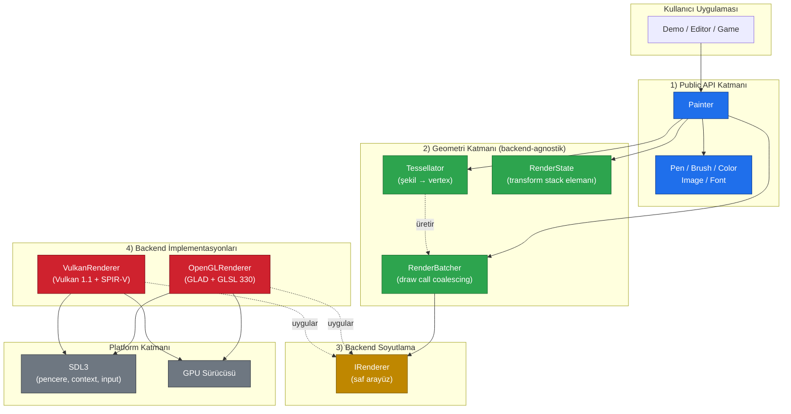
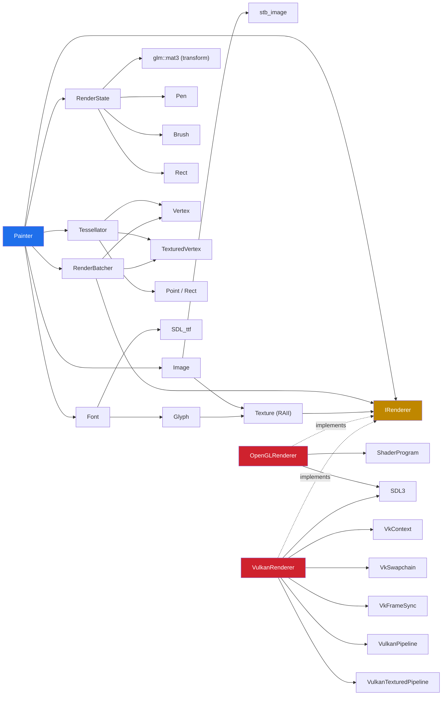
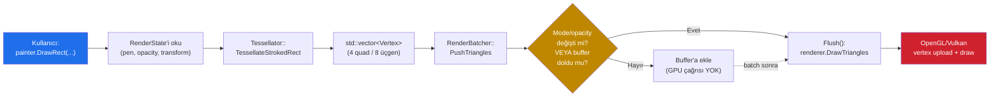
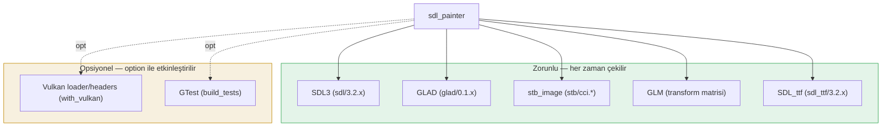

**Türkçe** | [English version](architecture.md)

# SDLPainter — Mimari Genel Bakış

Bu doküman SDLPainter'ın **katmanlı mimarisini**, **bileşenler arasındaki bağımlılıkları**
ve **veri akışını** üst seviyeden tarif eder. Sınıf detayları için
[Sınıf Diyagramı](sinif-diyagrami.md), çalışma zamanı akışları için
[Akış Diyagramları](akislar.md) belgelerine bakabilirsiniz.

---

## 1. Katmanlı Mimari

SDLPainter dört bağımsız katmandan oluşur. Her katman yalnızca bir altındaki
katmanın **arayüzüne** bağımlıdır; somut implementasyona değil.



### Katmanların Sorumlulukları

| Katman | Sorumluluk | Neyi BİLMEZ |
|--------|-----------|-------------|
| **Public API** | Kullanıcı API'sı, stil ve transform yönetimi | GPU, vertex formatı, batch detayı |
| **Geometri** | Şekilleri vertex'e çevirir, draw call'ları biriktirir | OpenGL/Vulkan komutları |
| **Backend Soyutlama** | Renderer arayüzü (sözleşme) | İmplementasyon detayı |
| **Backend İmpl.** | GPU komutları, shader, buffer, texture | Tessellation, stil, transform stack |

Bu ayrımın somut etkisi: `OpenGLRenderer`'ı `VulkanRenderer` ile değiştirmek
**sadece constructor argümanını değiştirmek**ten ibarettir. `Painter`,
`Tessellator`, `RenderBatcher`, `RenderState` dosyalarında tek satır
değişiklik yapılmaz.

---

## 2. Bileşen Bağımlılıkları

Her bileşenin başka hangi bileşenleri kullandığını gösteren bağımlılık grafiği:



> Kesintisiz oklar **doğrudan kullanım**, kesik oklar **arayüz uygulaması**
> (`implements`) ilişkisini gösterir.

---

## 3. Veri Akışı: Tek Bir `DrawRect` Çağrısı

`painter.DrawRect(x, y, w, h)` çağrısının kütüphane içinde izlediği yol:



**Önemli not:** Tipik bir frame'de birçok `DrawRect`/`DrawCircle` çağrısı
aynı pen ve opacity ile gelir. Bu durumda `Flush()` tetiklenmez; tüm
vertex'ler **tek bir GPU draw call**'ında gönderilir. Detaylar için
[akislar.md → Batch Flush Koşulları](akislar.md#3-render-batcher-akışı).

---

## 4. Modül Haritası — Kaynak Ağacı

```
sdl-painter/
├── include/sdl_painter/        ← Public API (kullanıcı bu header'ları görür)
│   ├── painter.h               · Ana çizim sınıfı
│   ├── pen.h, brush.h, color.h · Stil tipleri
│   ├── geometry.h              · Point, Rect, Size
│   ├── image.h, texture.h      · Görsel + RAII texture sarmalayıcı
│   ├── font.h                  · SDL_ttf wrapper, Alignment
│   ├── renderer.h              · IRenderer arayüzü + RendererBackend enum
│   └── vertex.h                · Vertex, TexturedVertex
│
├── src/                        ← İmplementasyon (kullanıcıya kapalı)
│   ├── painter.cpp             · API ↔ batcher/tessellator köprüsü
│   ├── render_batcher.{h,cpp}  · Draw call coalescing
│   ├── tessellator.{h,cpp}     · Şekil → vertex
│   ├── renderer.cpp            · CreateRenderer factory
│   ├── opengl/                 · OpenGL 3.3 backend
│   │   ├── opengl_renderer.{h,cpp}
│   │   ├── shader_program.{h,cpp}
│   │   └── shaders/*.{vert,frag}
│   └── vulkan/                 · Vulkan 1.1 backend
│       ├── vulkan_renderer.{h,cpp}     · IRenderer impl
│       ├── vk_context.{h,cpp}          · Instance, device, queue
│       ├── vk_swapchain.{h,cpp}        · Swapchain + image view
│       ├── vk_frame_sync.{h,cpp}       · Semaphore, fence
│       ├── vk_memory.{h,cpp}           · Buffer/image bellek
│       ├── vulkan_pipeline.{h,cpp}     · Untextured pipeline
│       ├── vulkan_textured_pipeline.{h,cpp}
│       ├── vulkan_buffer.{h,cpp}       · Vertex ring buffer
│       ├── vulkan_texture.{h,cpp}      · Texture + descriptor set
│       └── shaders/*.spv               · SPIR-V derlenmiş shader'lar
│
├── examples/                   ← Faz bazlı demo uygulamaları
│   ├── primitives.cpp          · Primitifler
│   ├── transforms.cpp          · Transform stack
│   ├── images.cpp              · Image
│   ├── text.cpp                · Text
│   └── vulkan_*.cpp            · Vulkan örnekleri
│
└── tests/                      ← GTest birim testleri
    ├── mock_renderer.h         · IRenderer mock'u
    ├── test_tessellator.cpp
    ├── test_render_batcher.cpp
    ├── test_transform.cpp
    └── ...
```

### Public ve Private Ayırımı

- `include/sdl_painter/*.h` → **Kullanıcıya açık**. ABI/API stabilite hedefi var.
- `src/*.h` (`tessellator.h`, `render_batcher.h`) → **İç implementasyon**.
  Kullanıcı bu header'ları include etmemeli.
- `src/opengl/*.h`, `src/vulkan/*.h` → Backend'e özel iç tipler.

---

## 5. Bağımlılık Yönetimi (Conan 2)



`with_vulkan=False` olduğunda Vulkan loader hiç indirilmez; CI süresi ve
container imaj boyutu küçük kalır. Detaylar için `conanfile.py` ve
[Derleme](building.md) *(İngilizce)*.

---

## 6. Sözleşmeler ve Değişmez Kurallar (Invariants)

Mimarinin tutarlı kalması için bileşenler arasında uyulan kurallar:

| Sözleşme | Açıklama |
|----------|----------|
| **Tessellator stateless** | Aynı input → aynı output, her zaman. GPU bağımlılığı yok. |
| **IRenderer salt arayüz** | Hiçbir state (transform, opacity stack) tutmaz; sadece komut alır. |
| **Painter, IRenderer'a sahiptir** | `unique_ptr<IRenderer>`; yaşam döngüsü Painter'a bağlı. |
| **RenderBatcher Painter'a aittir** | Painter dışında erişilemez; arayüzü internal. |
| **Texture handle opak** | `uint32_t`; backend bunu kendi haritasında çözer. |
| **Y ekseni Painter'da yukarı pozitif değil** | Painter Y=0 üstte; OpenGL scissor'unda flip ApplyScissor'da uygulanır. |
| **Frame sınırı: Begin/End** | İki çağrı arasında transform/state biriktirilir, End'te flush. |

Bu değişmezler bozulduğunda mimari avantajları (test edilebilirlik,
backend değiştirilebilirliği, performans öngörülebilirliği) kaybolur.

---

## 7. Sonraki Adımlar

- [Sınıf Diyagramı](sinif-diyagrami.md) — UML class diagram, ilişki türleri
- [Akış Diyagramları](akislar.md) — Frame, draw call, transform stack, texture upload sequence'leri
- [Backend İç Yapısı](backend-ic-yapisi.md) — OpenGL ve Vulkan implementasyon detayı
- [Hızlı Başlangıç](hizli-baslangic.md) — İlk Painter uygulaması
- [Yazılım Mühendisliği Perspektifi](sdl-painter-yazilim-muhendisligi.md) — Tasarım kararlarının gerekçeleri
