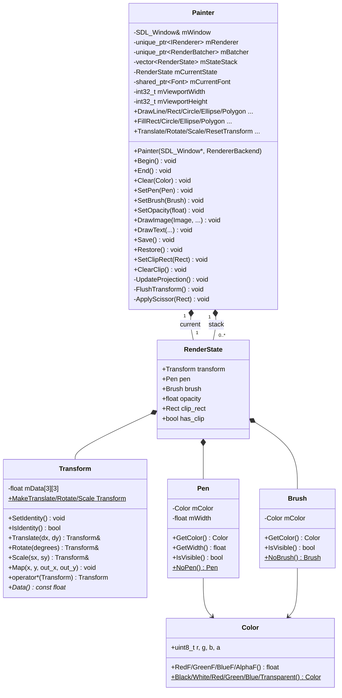
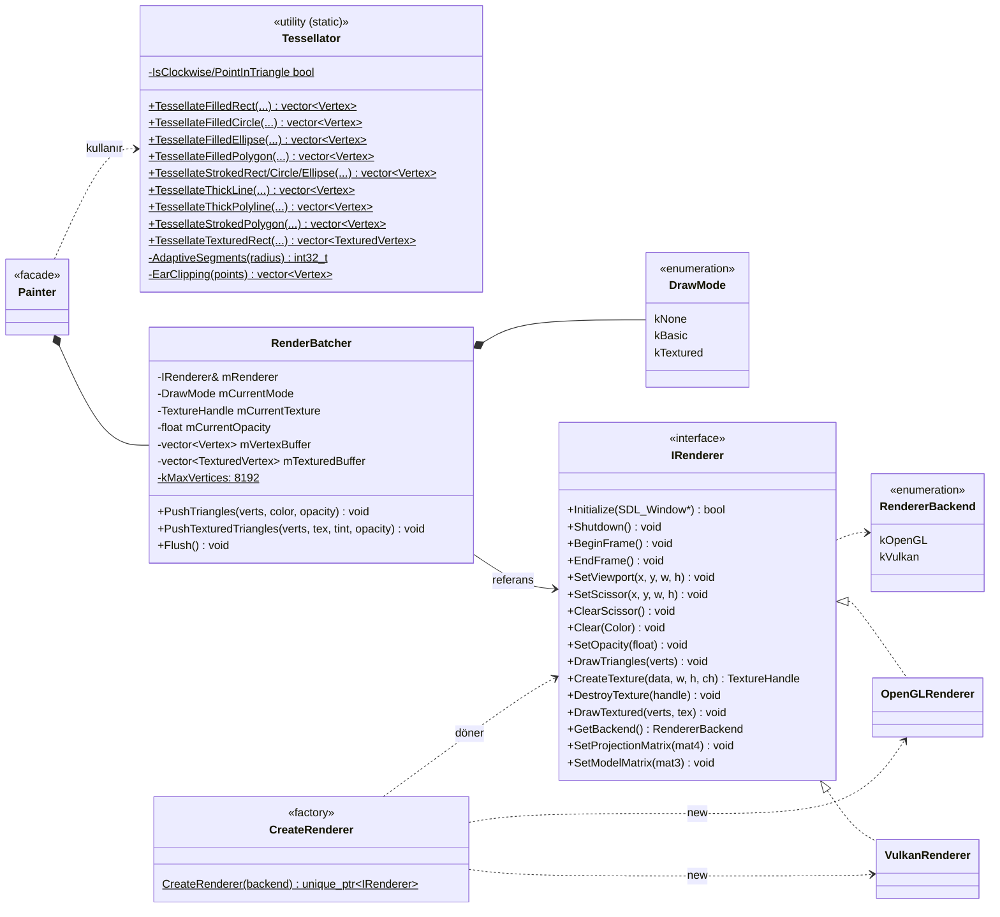
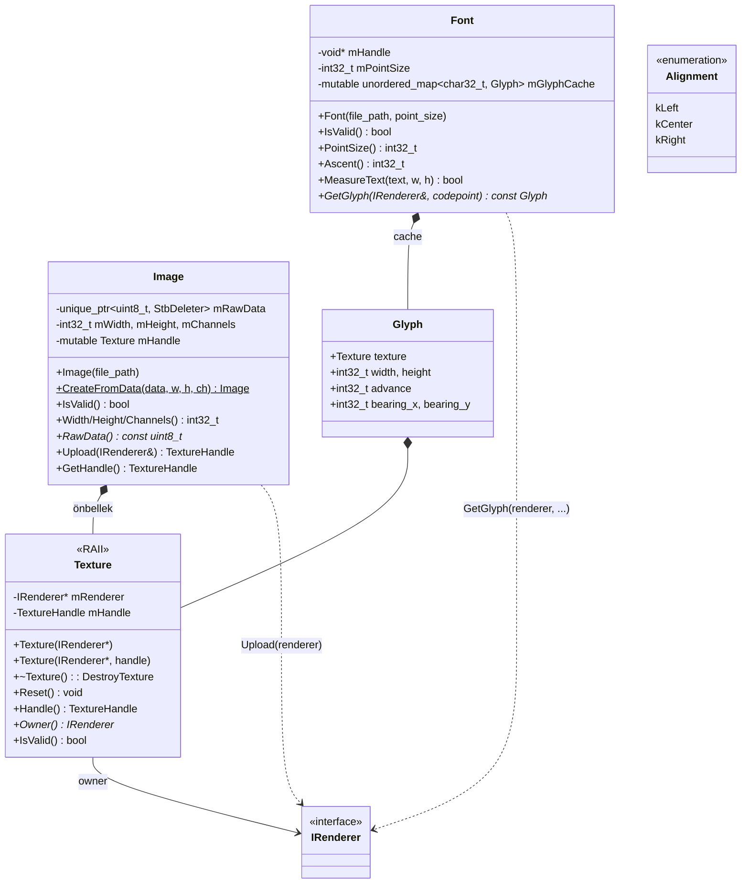
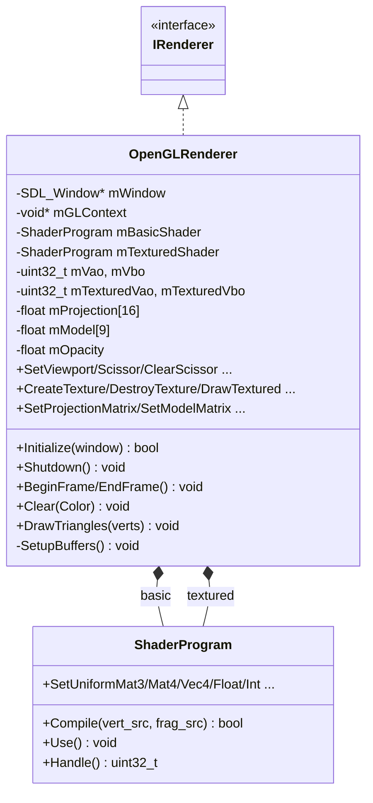
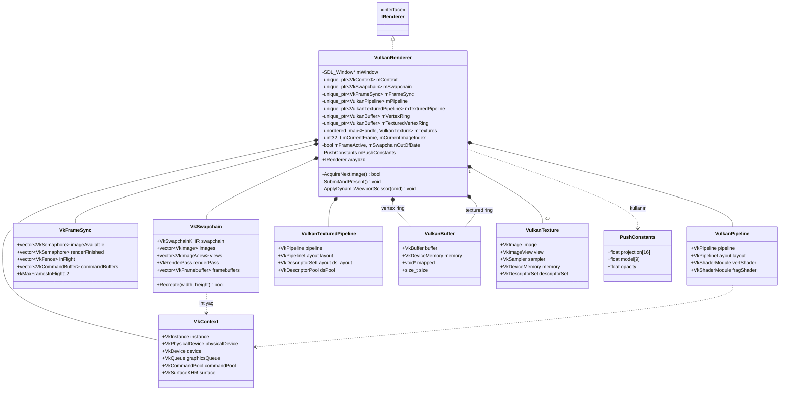
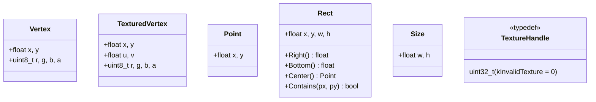

# SDLPainter — Sınıf Diyagramları

Bu dokümanda SDLPainter'ın **sınıf yapısı** Mermaid `classDiagram` notasyonuyla
verilmiştir. Diyagramlar parçalara bölünmüştür çünkü tek bir grafik hızla
okunamaz hale gelir; her parça farklı bir konsepte odaklanır.

---

## 1. Çekirdek Sınıflar — Painter ve Bağlamı

`Painter` etrafındaki üç temel kompozisyon: stil tipleri (`Pen`/`Brush`),
transform yığını (`RenderState` + `Transform`), ve render hattı
(`Tessellator` + `RenderBatcher` + `IRenderer`).

**İlişki notları**

- `Painter *-- RenderState`: Kompozisyon. `mCurrentState` aktif durum,
  `mStateStack` ise `Save()`/`Restore()` ile büyüyüp küçülen yığın.
- `static` factory metodları (`NoPen`, `Black`, `MakeTranslate`) `$` ile işaretli.

---

## 2. Render Hattı — Tessellator, RenderBatcher, IRenderer

**Kritik nokta:** `Painter` **doğrudan** `IRenderer` çağırmaz; tüm çizimler
`RenderBatcher` üzerinden gider. Sadece `Begin()`, `End()`, `Clear()`,
`SetViewport()`, `SetScissor()` gibi non-batch işlemler `IRenderer`'a
direkt iner.

---

## 3. Görsel ve Yazı Tipleri

**Notlar**

- `Texture` saf RAII sarmalayıcıdır; non-copyable, movable. Yıkıcısında
  sahibi olduğu renderer üzerinden `DestroyTexture` çağırır.
- `Image::Upload` idempotenttir: ikinci çağrıda mevcut handle döner
  (lazy upload + cache).
- `Font::GetGlyph` glyph cache miss'inde SDL_ttf'ten render edip
  texture'a yükler; sonraki çağrılarda cache'ten döner.

---

## 4. OpenGL Backend Sınıfları

OpenGL backend yalnızca üç dış parça kullanır: `ShaderProgram` (GLSL
program sarmalayıcısı), GLAD (function loader, sınıf değil), ve VAO/VBO
handle'ları.

---

## 5. Vulkan Backend Sınıfları

Vulkan backend OpenGL'e göre çok daha katmanlıdır çünkü pipeline,
descriptor, swapchain ve sync nesneleri ayrı ayrı yönetilmek zorundadır.

**Tasarım kararı:** Tüm Vulkan kaynakları `unique_ptr` ile yönetilir;
yıkıcı sırası hatalı kaynak yıkımını engeller. `VkContext` en uzun yaşayan
nesnedir, en son yıkılır.

---

## 6. Veri Tipleri Özeti (POD/Value)

Bu tipler **value semantic** taşır: kopyalanabilir, küçük ve kendi başına
anlamlı. `Vertex` ve `TexturedVertex` GPU'ya gönderilen yapılardır; layout
kritik olduğundan dikkatli değiştirilmeli (shader attribute ofsetleri ile
eşleşmeli).

---

## 7. İlişki Türleri Sözlüğü

| Sembol | Anlam | Örnek |
|--------|-------|-------|
| `*--` | **Kompozisyon** — sahibi yıkılınca üye de yıkılır | `Painter *-- RenderBatcher` |
| `o--` | **Agregasyon** — paylaşımlı sahiplik | (kullanılmıyor) |
| `-->` | **Doğrudan kullanım** — pointer/referans | `RenderBatcher --> IRenderer` |
| `..>` | **Bağımlılık** — kısa ömürlü kullanım, döndüğünde unutur | `Painter ..> Tessellator` |
| `<\|--` | **Kalıtım** | (interface dışında kullanılmıyor) |
| `<\|..` | **Arayüz uygulaması** | `IRenderer <\|.. OpenGLRenderer` |

Mermaid'in `<<interface>>`, `<<enumeration>>`, `<<utility (static)>>`,
`<<RAII>>`, `<<facade>>`, `<<factory>>`, `<<typedef>>` stereotipleri
sınıfın **karakterini** tek bakışta belirtmek için kullanıldı.
