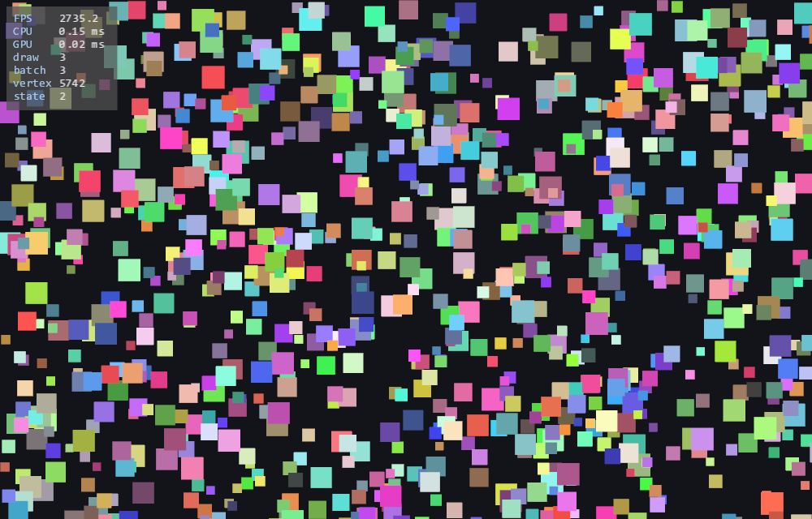
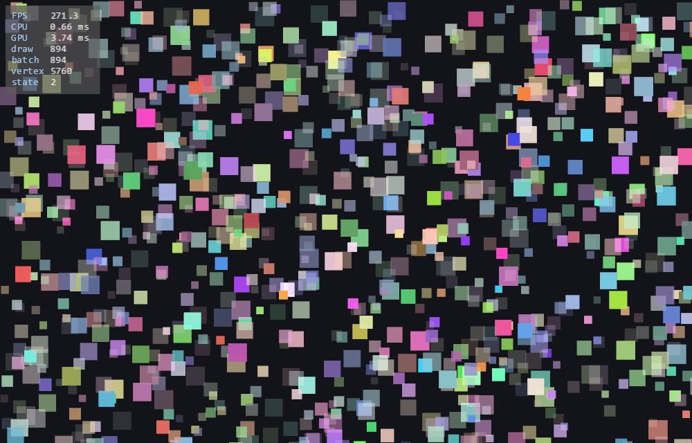

# SDLPainter Examples

Runnable demos, each isolating one capability. Build them with the
repository (they are on by default) and run them straight from the build tree:

```bash
cmake --preset linux-debug
cmake --build --preset linux-debug

./build/linux-debug/examples/primitives
```

On Windows the executables land under `build\windows-debug\examples\Debug\`.

To skip building the demos entirely: `-DSDLPAINTER_BUILD_EXAMPLES=OFF`.

One demo (`sprite_animation`) loads a file from [`assets/`](assets/); CMake
copies that directory next to the executables, and the demo resolves it through
`SDL_GetBasePath()`. Everything else is self-contained — and the **library**
itself ships no assets at all (shaders are embedded, see
[ADR-009](../adr/ADR-009-embedded-shaders.md)).

Sources are grouped by topic — `basics/`, `graphics/`, `app/`, `games/`,
`vulkan/` — but every executable is written to the **same** output directory,
so the run commands above are unaffected by where a source file lives. Adding a
demo is one line in [`CMakeLists.txt`](CMakeLists.txt); the helper is
[`cmake/AddExample.cmake`](../cmake/AddExample.cmake).

---

## Start here

| Demo | What it shows | Needs |
|---|---|---|
| [`minimal`](basics/minimal.cpp) | The smallest thing that works — 25 lines, no logger, no resize handling. Copy this into an empty project to verify your setup. | — |
| [`hello_window`](basics/hello_window.cpp) | Opens an SDL window and shuts down cleanly — verifies the toolchain, nothing is drawn. | — |
| [`primitives`](basics/primitives.cpp) | Every basic shape: filled and stroked rectangles, circles and ellipses, thick lines, polylines, a concave polygon. | — |
| [`transforms`](basics/transforms.cpp) | `Translate` / `Rotate` / `Scale`, nested `Save`/`Restore`, viewport tracking on resize. | — |
| [`clipping`](basics/clipping.cpp) | `SetClipRect` / `ClearClip`, plus a centre-rotation correctness check that stays centred at any window size. | — |
| [`images`](graphics/images.cpp) | `DrawImage` in all three overloads — original size, scaled destination rect, atlas slicing — with alpha blending and a rotating texture. | — |
| [`text`](graphics/text.cpp) | `DrawText` at a point and aligned inside a rect, `Font::MeasureText`, multiple point sizes, coloured and semi-transparent text. | SDL_ttf |
| [`viewports`](basics/viewports.cpp) | Split screen and a minimap. `SetViewport` makes coordinates **panel-local**, so all four panels call the same drawing function with no offset arithmetic — and clip rects are panel-local too. | — |
| [`input`](basics/input.cpp) | The difference between key **events** (one-shot) and key **state** (continuous) — and why writing movement with events feels wrong. Mouse tracking and a dashed crosshair. | — |

## Drawing in depth

| Demo | What it shows | Needs |
|---|---|---|
| [`plasma`](graphics/plasma.cpp) | A texture regenerated on the CPU **every frame** and uploaded in place with `Painter::UpdateImage` — no allocate/free churn. | — |
| [`particles`](graphics/particles.cpp) | Tens of thousands of particles in **two** draw calls, with a live counter. SPACE switches to a batch-breaking pattern so the cost is visible side by side. | — |
| [`sprite_animation`](graphics/sprite_animation.cpp) | A real CC0 sprite sheet sliced on an 8×4 grid. Its left- and right-facing rows are exact mirrors, so the demo draws the right-facing walk **either** from the sheet **or** by flipping the left row — pixel-identical, which is the argument for `ImageFlip` in one picture. | [asset](assets/) |
| [`physics_rope`](graphics/physics_rope.cpp) | A Verlet rope and cloth: the honest stress test for thick-line joins and caps, cycled live with J and C. | — |
| [`strokes`](graphics/strokes.cpp) | Every pen axis side by side — cap, join, dash pattern, rounded rects and arcs. Reference marks show exactly how far each cap overhangs the real endpoint, and a row of narrowing angles shows miter falling back to bevel on its own. | — |
| [`paths`](graphics/paths.cpp) | `Path` with quadratic and cubic Beziers. Curves are flattened when they enter the path, so every pen axis — cap, join, dash — keeps working on them; the arrow keys change the flattening tolerance and the generated points are drawn on top, so the trade-off is visible rather than described. The last row shows the documented limit: sub-paths fill independently, so an inner ring does **not** punch a hole. | — |
| [`render_target`](graphics/render_target.cpp) | Drawing into a texture instead of the screen. The same target is shown three ways: full size, as a cheap mini-map (the scene is **not** drawn twice), and as a fading trail built by ping-ponging two targets — which is also the demo of the one rule you cannot break: a target may not sample itself. | - |
| [`gradients`](graphics/gradients.cpp) | Gradients without a shader, and an honest look at the catch: the transition is only as fine as the shape's vertex density. A row of polygons from 3 to 64 corners makes the limit visible; press **G** to see the vertices themselves. All of it still batches into one draw call. | — |
| [`blend_modes`](graphics/blend_modes.cpp) | The four blend modes side by side, and their cost. Colour and tint ride in the vertex so they batch freely; **blend mode is GPU state and cannot** — press SPACE to switch between grouping by mode and changing it per shape, and watch the draw-call counter. | — |
| [`pixel_art`](graphics/pixel_art.cpp) | The same sprite at the same scale, `kLinear` on the left and `kNearest` on the right, with a sweeping divider. One line of difference, decisive result. | [asset](assets/) |
| [`mesh_warp`](graphics/mesh_warp.cpp) | `DrawImageMesh`: a textured grid whose corners move independently — a waving flag. Press **1/2/3** to change grid resolution and see how the curve is only as fine as the vertex count. | [asset](assets/) |
| [`charts`](graphics/charts.cpp) | Pie, bar and line charts: `FillPie` / `DrawPie`, a dashed grid, labels aligned with `Font::MeasureText`, and a caption box that word-wraps. Press **W** to turn wrapping off and watch it overflow. | — |
| [`morph`](graphics/morph.cpp) | Smooth interpolation between a circle, a star and a concave cross — the tessellator re-runs every frame on deliberately awkward shapes. | — |

| | |
|:---:|:---:|
|  |  |
| **`primitives`** | **`images`** |
|  |  |
| **`text`** | **`tictactoe`** |

## Application framework

The window, event loop and timing layer is optional and lives in a separate
target (`sdl_painter::app` — see
[ADR-008](../adr/ADR-008-application-framework-layer.md)).

| Demo | What it shows | Needs |
|---|---|---|
| [`app_basics`](app/app_basics.cpp) | The same visual output as `transforms`, without its ~250 lines of SDL boilerplate. | — |
| [`game_loop`](app/game_loop.cpp) | Fixed-timestep simulation with render interpolation — a bouncing ball stays smooth even at a low `fixed_update_hz`. | — |
| [`paint`](app/paint.cpp) | A real drawing program: freehand strokes, a colour palette, brush size, eraser and undo. Strokes are stored as point lists and re-drawn each frame, which makes undo a one-liner. | — |
| [`stats_overlay`](app/stats_overlay.cpp) | The on-screen FPS / frame-stats overlay: `AppConfig::stats_overlay`, `show_fps_in_title`, **F1** to cycle modes, and `SPACE` to switch between a batch-friendly and a batch-breaking draw pattern so the draw-call difference is visible live. | SDL_ttf |

## Games and worlds

| Demo | What it shows | Needs |
|---|---|---|
| [`tictactoe`](games/tictactoe.cpp) | A complete application: mouse hit testing, hover highlighting, responsive layout on resize, and an app state machine. Turn-based, so nothing moves on its own. | SDL_ttf |
| [`breakout`](games/breakout.cpp) | What `tictactoe` leaves out: continuous motion, frame-independent physics, sub-stepped collision (no tunnelling) and a menu → play → win/lose state machine. | — |
| [`camera_scroll`](games/camera_scroll.cpp) | The transform stack used as a camera: world ↔ screen conversion, parallax layers, cursor-anchored zoom, and a HUD that stays put. | — |
| [`tilemap`](games/tilemap.cpp) | A tile grid drawn from one atlas with view-frustum culling. Press **C** to turn culling off and watch the vertex counter explode. | — |

The pure logic of the games sits in headers next to them —
[`tictactoe_logic.h`](games/tictactoe_logic.h) and
[`collision_logic.h`](games/collision_logic.h) — so it can be unit tested
without a window (`tests/test_tictactoe_logic.cpp`,
`tests/test_collision_logic.cpp`).

The overlay is available in **every** `Application` — F1 turns it on, no code
change needed:

| Batch-friendly | Per-shape opacity |
|---|---|
|  |  |
| 3 draw calls · 3735 FPS · GPU 0.02 ms | 894 draw calls · 271 FPS · GPU 3.74 ms |

## Benchmarks

[`benchmarks/`](benchmarks/) is not a demo but a measurement rig: it reports
how many draw calls each drawing pattern costs, writes CSV results and can
dump a PNG per scenario. See [benchmarks/README.md](benchmarks/README.md) —
the numbers there are what drove the CPU-side transform change.

## Vulkan backend

All of these require `-DSDLPAINTER_WITH_VULKAN=ON` (Conan:
`-o "&:with_vulkan=True"`). They verify that the Vulkan backend behaves
identically to OpenGL, one capability at a time.

| Demo | What it shows | Needs |
|---|---|---|
| [`vulkan_clear`](vulkan/vulkan_clear.cpp) | Instance, device, swapchain and `Clear`. | Vulkan |
| [`vulkan_triangles`](vulkan/vulkan_triangles.cpp) | Untextured primitives, transform stack, opacity. | Vulkan |
| [`vulkan_textured`](vulkan/vulkan_textured.cpp) | Texture upload and sampling through `DrawTextured`. | Vulkan |
| [`vulkan_demo`](vulkan/vulkan_demo.cpp) | Swapchain recreation on resize, every primitive, every opacity level — validation layers must stay silent. | Vulkan |
| [`vulkan_text`](vulkan/vulkan_text.cpp) | SDL_ttf glyph atlases on the Vulkan backend, including UTF-8. | Vulkan + SDL_ttf |

## The hero animation

| Demo | What it shows | Needs |
|---|---|---|
| [`hero`](hero.cpp) | The choreographed showcase behind the README banner — a four-act tour of the whole library on a 12-second perfect loop. | SDL_ttf |

Unlike the others this one is a *composition* rather than an isolated feature.
Each act runs for three seconds, fading in and out on its own:

| Act | Shows |
|---|---|
| **01 · Shapes & paths** | Rect, rounded rect, circle, ellipse, arc, pie, chord; dash patterns; butt/square/round caps; miter/round/bevel joins; a Bézier `Path`, stroked and filled |
| **02 · Color & blending** | Linear and radial gradients, a gradient-filled concave polygon (ear clipping), additive and multiply blend modes, the global opacity ramp |
| **03 · Transform & clip** | A nested transform stack, scissor clipping, a viewport with its own local coordinates, and 276 individually transformed quads that still batch |
| **04 · Images & text** | Texture scaling/tint/flip, nearest vs. linear sampling on pixel art, a free-form `DrawImageMesh` warp, a `RenderTarget` stamped three times, and SDL_ttf with word wrap |

The footer carries the live `FrameStats` counters, so the draw-call cost of
everything on screen is visible in the banner itself. It can render to disk
instead of to a window:

```bash
./build/linux-debug/examples/hero                                 # watch it
./build/linux-debug/examples/hero --dump-frames build/hero_frames # 360 PPM frames
./scripts/make-hero-gif.sh --fps 12                               # → doc/hero.gif
```

Dumping frames beats screen recording here: no cursor, no window chrome, no
dropped frames, and the loop closes exactly. It needs `ffmpeg` only for the
final assembly step. Frame 360 is identical to frame 0 because every act is
fully faded out at its own boundaries — animations inside an act therefore
don't have to complete a whole number of periods.

---

## Development phases

SDLPainter was built phase by phase, and the demos were originally named after
those phases. The names changed after v1.1.0; this table maps the old names so
that write-ups and blog posts referring to a phase still lead somewhere.

| Phase | Old name | Current name |
|---|---|---|
| 0 | `phase0_demo` | `hello_window` |
| 1 | `phase1_demo` | `primitives` |
| 2 | `phase2_demo` | `transforms` |
| 2b | `phase2b_demo` | `clipping` |
| 3 | `phase3_demo` | `images` |
| 4 | `phase4_demo` | `text` |
| 5a | `phase5a_vulkan_clear` | `vulkan_clear` |
| 5b | `phase5b_vulkan_triangles` | `vulkan_triangles` |
| 5c | `phase5c_vulkan_textured` | `vulkan_textured` |
| 5d | `phase5d_vulkan_demo` | `vulkan_demo` |
| 5e | `phase5e_vulkan_text` | `vulkan_text` |
| 6 | `phase6_app_demo` | `app_basics` |
| 7 | `phase7_game_demo` | `game_loop` |
| 8 | `phase8_tictactoe` | `tictactoe` |
| — | — | `hero` *(new, not part of the phased build-up)* |

Each source file also repeats its phase in the header comment.

---

A longer walkthrough of every demo — what it verifies and why it is written
that way — is in [`doc/sdl-painter-ornekler.md`](../doc/sdl-painter-ornekler.md)
*(in Turkish)*.
