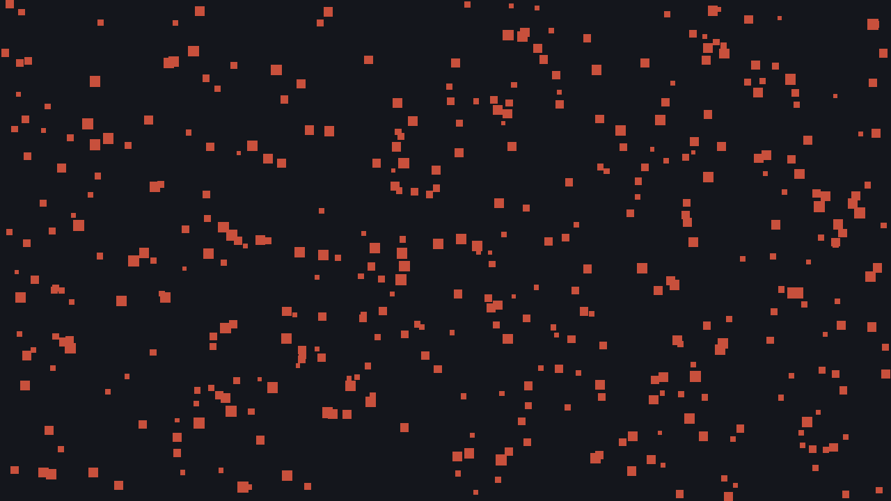
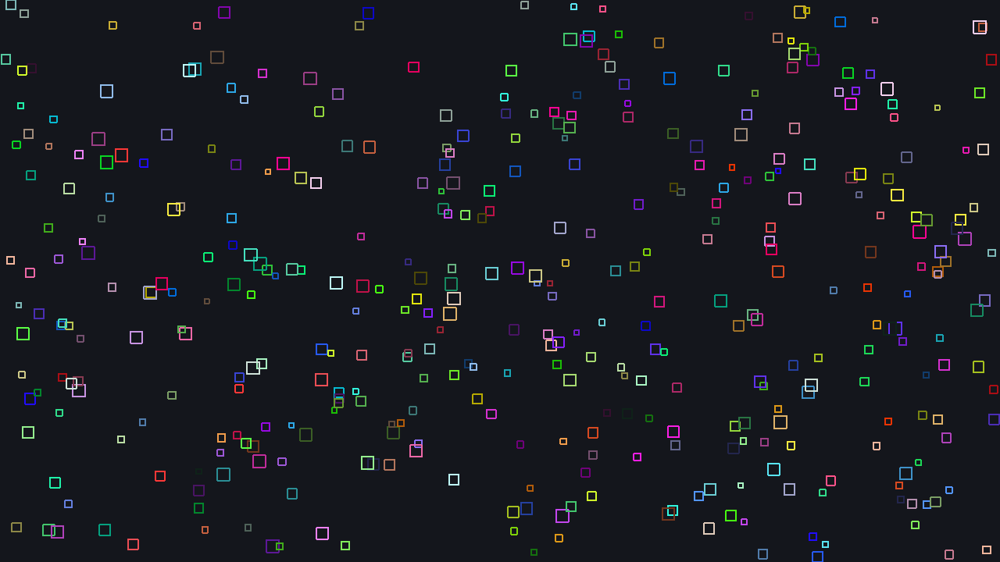
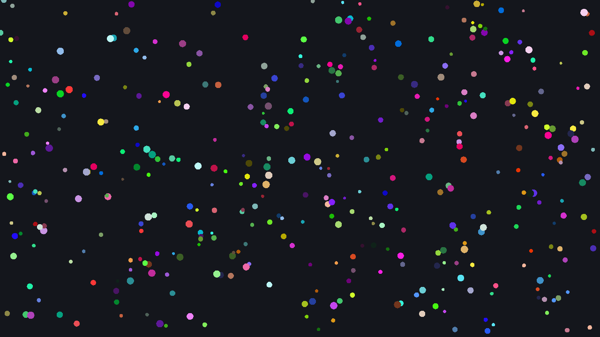
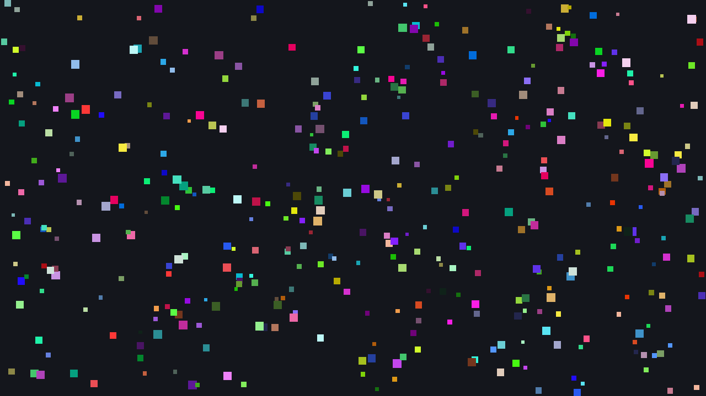
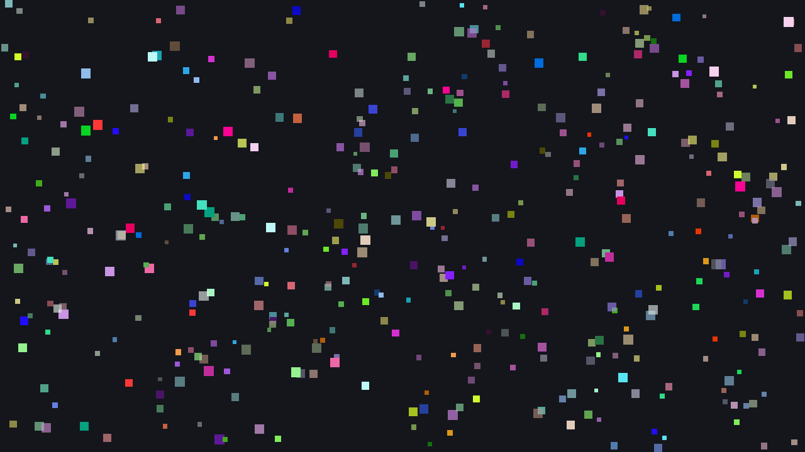
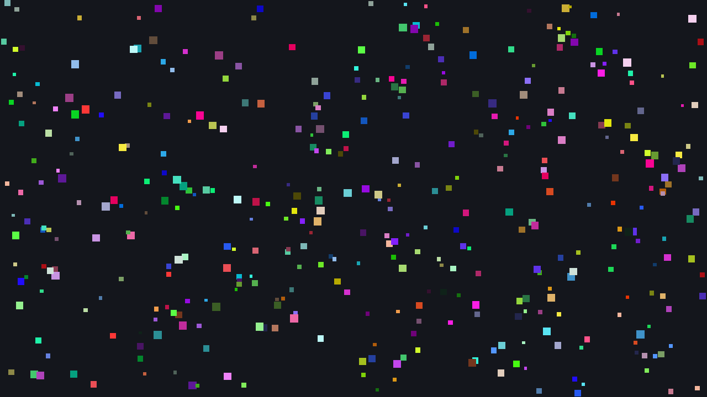
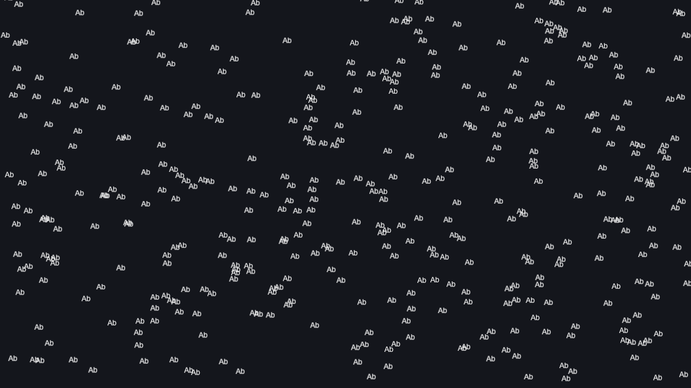
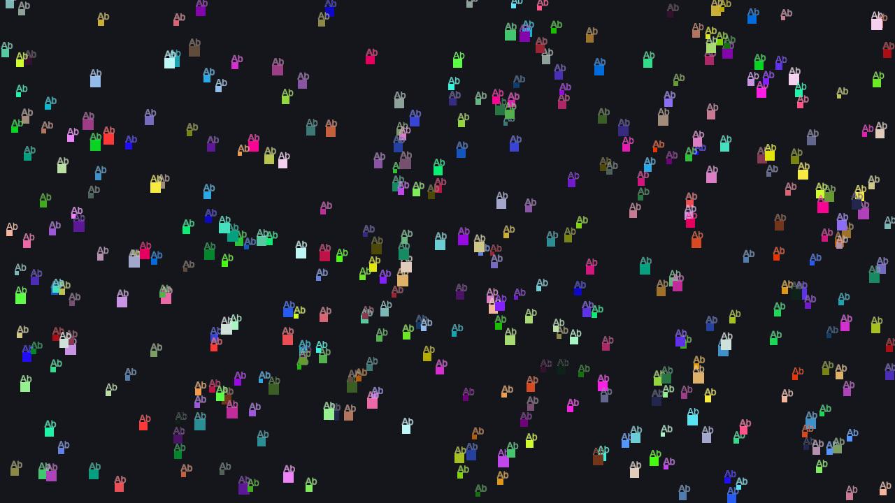

# Batch Verimliliği Ölçümü

`RenderBatcher`'ın hangi çizim desenlerinde işe yaradığını, hangilerinde
yaramadığını **değerlerle** gösteren uygulamadır/ölçümdür.

Buradaki hedefimiz: *"Farklı renklerde çok sayıda şekil çizerken
batch'lemenin faydası oluyor mu gerçekten?"* Cevap hem evet hem hayır oldu. 
"hayır" kısmını iyileştirmek adına transform'un **CPU tarafına taşınması** karar verdik.

## Nasıl ölçülüyoruz

Kütüphanenin direk içerisine sayaç eklemedik. `Painter`'ın hazır bir renderer kabul eden
ctor'u sayesinde (`Painter(std::unique_ptr<IRenderer>, w, h)`), gerçek
`OpenGLRenderer` bir sarmalayıcının içine konur (diğer bir ifade ile ilave bir katman):

```
Painter → RenderBatcher → CountingRenderer → OpenGLRenderer → GPU
                            (sayaçlar)
```

`CountingRenderer` (`counting_renderer.h`) yalnızca public API'ye bağlı;
`DrawTriangles` / `DrawTextured` çağrılarını, gönderilen vertex sayısını ve
`SetModelMatrix` / `SetOpacity` / `SetScissor` uniform-durum yüklemelerini
sayıyor, sonra çağrıyı olduğu gibi iletiyor.

**Kilit metrik `draw/kare`.** 1'e ne kadar yakınsa batch o kadar verimli.
2000 şekil için 2000 çıkıyorsa batch'leme o desende hiç çalışmıyor demektir.

> Uygulama içinde aynı sayaçlara `Painter::GetFrameStats()` ile de
> erişilebilir; `Application` tabanlı uygulamalarda F1 ekran üstü göstergeyi
> açar (bkz. `examples/app/stats_overlay.cpp`).

## Çalıştırma

```bash
cmake --build --preset windows-release --target batching_benchmark
./build/windows-release/examples/benchmarks/Release/batching_benchmark.exe \
    --shapes=2000 --frames=300 --csv=results/windows-release-opengl.csv
```

| Argüman | Varsayılan | Anlam |
|---------|-----------|-------|
| `--shapes=N` | 2000 | Kare başına çizilen şekil sayısı |
| `--frames=N` | 200 | Ölçülen kare sayısı (öncesinde 5 kare ısınma) |
| `--null` | kapalı | Pencere/OpenGL açma; yalnızca CPU yolunu ölç |
| `--csv=DOSYA` | — | Sonuçları CSV olarak da yaz |
| `--screenshot=DIZIN` | — | Her senaryonun çıktısını `<senaryo>.png` olarak kaydet |

`--null` modu GPU'yu tamamen devre dışı bırakır. `opengl` ile arasındaki
süre farkı **doğrudan draw call maliyetidir** — bu ikisini karşılaştırmak
ölçümün asıl amacı.

Notlar:
- Vsync `SDL_GL_SetSwapInterval(0)` ile kapatılır; aksi halde ölçülen şey
  ekranın tazeleme hızı olurdu.
- Yerleşim ve renkler sabit tohumlu bir LCG ile üretilir (`std::rand`
  implementasyona göre değişir, karşılaştırma bozulurdu).
- **Release derleme zorunlu.** Debug'da CPU yolu ~15× şişer ve draw call
  maliyeti gerçek oranından küçük görünebilir.
- Ekran görüntüsü, `CountingRenderer`'ın sunumdan önceki kancasıyla arka
  tampondan okunur (`screenshot.cpp`) — `examples/hero.cpp`'deki
  `glReadPixels` + `SDL_GL_GetProcAddress` yaklaşımının aynısı.

## Senaryolar

| Senaryo | Ne test ediyor | Görüntü |
|---------|----------------|---------|
| `fill_same_color` | Referans — ulaşılabilir en iyi durum |  |
| `fill_many_colors` | Şekil başına farklı renk |  |
| `stroke_many_colors` | Kalem çerçevesi — tessellation maliyeti |  |
| `circles_many_colors` | Adaptif segmentli daire |  |
| `translate_per_shape` | `Save`/`Translate`/`Restore` |  |
| `translate_rotate_per_shape` | "Nesne başına yerel uzay" deseni |  |
| `opacity_alternating` | `SetOpacity` (opaklık uniform) |  |
| `clip_per_shape` | `SetClipRect` (scissor GPU durumu) |  |
| `text_only` | Glyph atlası tek batch'e giriyor mu? |  |
| `shapes_and_text` | Şekil ↔ metin mod değişimi |  |

> `fill_many_colors` ile `translate_per_shape` görüntüleri **birebir aynı** —
> aynı kareyi üreten iki farklı çizim deseni. Transform CPU'ya taşınmadan
> önce biri 2, diğeri 2000 draw call harcıyordu. Ölçmeden bakıldığında
> görülemeyen fark tam olarak bu.

Görüntüler `--shapes=400` ile üretilmiştir (2000 şekilde okunaksız oluyor):

```bash
batching_benchmark --shapes=400 --frames=60 --screenshot=doc/images/benchmarks
```

## Sonuçlar

Ölçüm ortamı: Windows 11, MSVC Release, 1280×720, vsync kapalı,
2000 şekil × 300 kare. Ham çıktılar `results/` altında.

### Güncel

Her senaryo **aynı kareyi** üretir: 1280×720'lik alana sabit tohumlu bir LCG
ile serpiştirilmiş **2000 küçük şekil** — kenarı 6–16 piksel, her biri rastgele
renkli (metin senaryolarında aynı konumlara `"Ab"` yazısı). Yerleşim ve renkler
tüm senaryolarda birebir aynıdır; tek değişen şekillerin *nasıl* çizildiğidir
(renk değişimi, transform, opaklık, clip, metin). Böylece sayılardaki fark
doğrudan çizim deseninden gelir.

Sütunlar (**kare** = frame, yani ekrana bir kez çizilen tam görüntü):

| Sütun | Anlamı |
|-------|--------|
| `draw/kare` | Bir karede GPU'ya giden çizim çağrısı sayısı (`DrawTriangles` + `DrawTextured`). Batch verimliliğinin doğrudan ölçüsü: aynı 2000 şekil tek karede **2** çağrıya sığıyorsa batch çalışıyor, **2000** çağrıya çıkıyorsa şekil başına bir çağrı düşmüş, yani batch hiç çalışmamış demektir. |
| `vertex` | Bir karede gönderilen toplam vertex sayısı — 2000 şeklin üçgenlere bölünmüş hâli (dikdörtgen 6, daire onlarca vertex). Tessellation maliyetinin göstergesidir ve draw call sayısından bağımsızdır: aynı vertex yığını ya tek çağrıya sığar ya da onlarca çağrıya bölünür. |
| `ms (OpenGL)` | Gerçek GPU yoluyla kare süresi: `Begin()`…`End()` arasının 300 kare ortalaması (CSV'de `ms_avg`). |
| `ms (null)` | Aynı karenin `--null` ile ölçülmüş hâli: yalnızca `Painter` + `Tessellator` + `RenderBatcher` CPU maliyeti, hiçbir GPU çağrısı yok. |
| `fark` | `ms (OpenGL) − ms (null)`. Sürücüye/GPU'ya ödenen bedel; bu ölçümde pratik olarak **draw call maliyeti**. |

CSV'de üç sütun daha var: `model_uploads_per_frame` / `opacity_uploads_per_frame` /
`scissor_changes_per_frame` (kare başına uniform ve GPU durumu yükleme sayısı —
bir batch'in neden kırıldığını gösterirler) ve `ms_min` (en hızlı kare; arka plan
gürültüsünden en az etkilenen değer).

| Senaryo | draw/kare | vertex | ms (OpenGL) | ms (null) | fark = draw call maliyeti |
|---------|----------:|-------:|------------:|----------:|--------------------------:|
| `fill_same_color` | **2** | 12 000 | 0.32 | 0.19 | 0.13 |
| `fill_many_colors` | **2** | 12 000 | 0.38 | 0.20 | 0.18 |
| `stroke_many_colors` | 24 | 192 000 | 3.85 | 3.53 | 0.32 |
| `circles_many_colors` | 12 | 96 000 | 1.53 | 1.43 | 0.10 |
| `translate_per_shape` | **2** | 12 000 | 0.30 | 0.23 | 0.07 |
| `translate_rotate_per_shape` | **2** | 12 000 | 0.37 | 0.30 | 0.07 |
| `opacity_alternating` | **2000** | 12 000 | 8.35 | 0.20 | **8.15** |
| `clip_per_shape` | **2000** | 12 000 | 8.86 | 0.23 | **8.63** |
| `text_only` | 3 | 24 000 | 0.61 | 0.45 | 0.16 |
| `shapes_and_text` | **4000** | 36 000 | 19.07 | 0.70 | **18.37** |

### Transform CPU'ya taşınmadan önce

Karşılaştırma verisi: `results/windows-release-opengl-before-cpu-transform.csv`
(model matrisinin hâlâ bir shader uniform'u olduğu hâl).

Sütunlar yukarıdakiyle aynı, yalnızca iki ölçüm yan yana yazılmıştır; `kazanç`
= `ms (önce) / ms (sonra)` oranıdır.

| Senaryo | draw/kare (önce → sonra) | ms (önce → sonra) | kazanç |
|---------|--------------------------|-------------------|-------:|
| `translate_per_shape` | 2000 → **2** | 9.44 → **0.30** | **31×** |
| `translate_rotate_per_shape` | 2000 → **2** | 9.37 → **0.37** | **25×** |
| `fill_same_color` | 2 → 2 | 0.36 → 0.32 | — |

Yan etkiler: kare başına `SetModelMatrix` yüklemesi **2001 → 1**,
`translate_per_shape`'te gereksiz `ClearScissor` çağrısı **2000 → 0**.
Diğer senaryolarda ölçülebilir bir yavaşlama yok — vertex başına 4 çarpma
+ 2 toplama, tasarruf edilen draw call'ların yanında görünmüyor.

### Çıkarımlar

**1. Farklı renk batch'i kırmıyor.** `fill_same_color` ile
`fill_many_colors` aynı: 2 draw call. Renk `Vertex` içinde taşındığı için
(`render_batcher.cpp`, `basic.vert`'teki `a_color`) `SetBrush` bedava.
İki draw call'ın sebebi renk değil, `kMaxVertices = 8192` tavanı
(12 000 vertex → 2 batch).

**2. Transform de artık batch'i kırmıyor.** Model matrisi bir shader
uniform'u olduğu sürece her `Translate`/`Rotate` bir flush tetikliyordu.
Artık vertex'ler `RenderBatcher` içinde, rengin yazıldığı kopyalama
döngüsünde CPU'da dönüştürülüyor; model matrisi daima birim.

**3. Geriye kalan batch kırıcılar: opaklık, clip, mod değişimi.** Üçü de
gerçek GPU durumu:

| Kırıcı | Neden | Kaldırılabilir mi? |
|--------|-------|--------------------|
| `SetOpacity` | `u_opacity` uniform'u | Evet — vertex alfasına katlanabilir |
| `SetClipRect` | scissor box, GPU durumu | Hayır (shader tabanlı clip olmadan) |
| şekil ↔ metin | ayrı shader + VAO | Evet — tek shader + 1×1 beyaz texture |

**4. Draw call başına maliyet ~4.1 µs, ölçekle doğrusal**
(`opacity_alternating` üzerinden, tek batch kırıcısı o):

| şekil | draw/kare | ms |
|------:|----------:|---:|
| 500 | 500 | 2.09 |
| 2 000 | 2 000 | 8.35 |
| 8 000 | 8 000 | 32.27 |

**5. Şekil ↔ metin geçişi şu an en pahalı desen.** 2000 şekil + 2000 metin
= 4000 draw call → 19 ms. Metin tek başına (`text_only`) 3 draw call ile
0.61 ms; yani glyph atlası kendi işini yapıyor, sorun **karışım**.

**6. `stroke_many_colors` ve `circles_many_colors` farklı bir problem.**
Draw call sayıları düşük (24 / 12) ama süreleri yüksek — ve `--null`
modunda da yüksek. Burada darboğaz batch değil, **CPU tessellation**.
Batch'leme iyileştirmesi bu iki senaryoya dokunmaz.
